За более подробной информацией можно обратиться в [источник](https://html5book.ru/html-html5/)

Также в дополнение, кому будет мало, то можно почитать часть курса по [web](https://smartiqa.ru/courses/web/lesson-2-html)

[Шпаргалка по тегам HTML](https://html5book.ru/examples/html-tags.html) 

Комментарии в HTML оставляются между символов `<!-- и -->`

```html
<!-- это строка комментарий -->
<!--
А это
многострочный
комментарий
-->
```

## Элементы для размещения текста

* `<br>` - позволяет сделать перенос текста на следующую строку.

* `<hr>` - используется для разделения контента на веб-странице. Отображается в виде горизонтальной линии.

* `<p>`...`</p>` - используется для создания абзацев текста на веб-странице. 
Этот тег помогает оформлять и структурировать текст, разделяя его на логические блоки, что делает веб-страницу более 
читаемой и понятной для пользователей. Абзацы — это блоки текста, физически отделенные от смежных блоков пустыми строками.

* `<pre>`...`</pre>` - позволяет отображать текст с сохранением пробелов и переносами строк так, как он записан в исходном коде. 
Это полезно для отображения программного кода или форматированного текста.

* `<code>`...`</code>` - используется для обозначения фрагментов программного кода, и текст внутри него обычно отображается с 
моноширинным шрифтом.

Ниже пример с данными тегами:

```html
<pre>
Политех
    Я    помню    чудное      мгновение
</pre>
Политех<br>
    Я    помню    чудное      мгновение
<br><br>
<code>Python is best code language</code>
<br>
<hr>
<br>
<p>У лукоморья дуб зелёный;<p>
<p>Златая цепь на дубе том:<p>
<p>И днём и ночью кот учёный<p>
<p>Всё ходит по цепи кругом;<p>
```

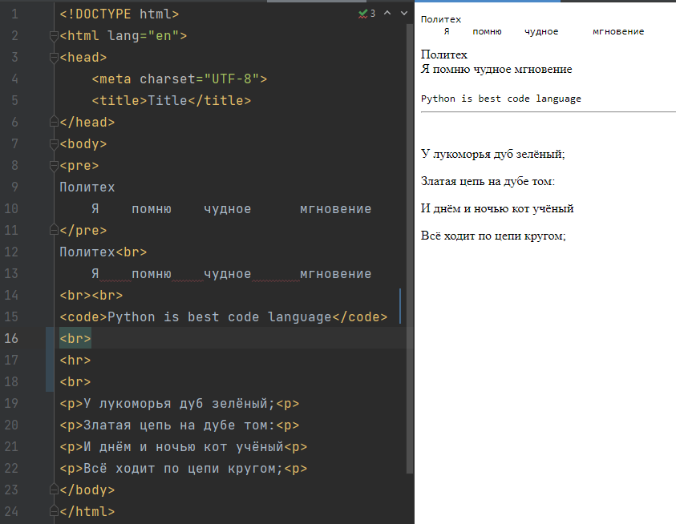

Видно, что шрифт текста не такой, как в нашем IDE, так как у HTML есть стандартные шрифты, чтобы они поддерживались на 
всех устройствах способных работать с HTML. Про теги работы со шрифтами будет рассмотрено позже.

## Заголовочные элементы

Заголовки являются важными элементами веб-страницы, они упорядочивают текст, формируя его визуальную структуру. 
Элементы `<h1>...<h6>` должны использоваться только для выделения заголовков нового раздела или подраздела.

Заголовки удобно использовать, когда нет необходимости точного значения размера шрифта. Размер пропорционален значению `em`.
1 em равен размеру в пикселях, делённому на базовое значение (по умолчанию 16px)


* `<h1>`...`</h1>` - заголовок самого верхнего уровня, на странице рекомендуется использовать только один раз, 
по возможности частично дублируя заглавие страницы. Элемент `<h1>` должен быть уникальным для каждой страницы сайта. 
Рекомендуется прописывать в начале статьи, используя ключевое слово в тексте заголовка. Размер шрифта в браузере равен `2em`, 
верхний и нижний отступ по умолчанию `0.67em`.


* `<h2>`...`</h2>` - представляет подзаголовки элемента `<h1>`. Размер шрифта в браузере равен `1.5em`, 
верхний и нижний отступ по умолчанию `0.83em`.


* `<h3>`...`</h3>` - Показывает подзаголовки элемента `<h2>`. Размер шрифта в браузере равен `1.17em`, верхний и нижний отступ 
по умолчанию `1em`.


* `<h4>`...`</h4>`, `<h5>`...`</h5>`, `<h6>`...`</h6>` Обозначают подзаголовки четвёртого, пятого и шестого уровня. 
Размер шрифта в браузере равен `1em` / `0.83em` / `0.67em`, верхний и нижний 
отступ по умолчанию `1.33em` / `1.67em` / `2.33em` соответственно.

```html
<h1>Заголовок h1</h1>
<h2>Заголовок h2</h2>
<h3>Заголовок h3</h3>
<h4>Заголовок h4</h4>
<h5>Заголовок h5</h5>
<h6>Заголовок h6</h6>
```


## Элементы для форматирования текста

[Подробнее](https://html5book.ru/semantika-urovnya-teksta)

* `<b>`...`</b>` - задаёт полужирное начертания шрифта. Выделяет текст без акцента на его важность.


* `<strong>`...`</strong>` - задаёт полужирное начертание шрифта, относится к элементам логической разметки, указывая браузеру на важность текста.


* `<i>`...`</i>` - отображает шрифт курсивом.


* `<em>`...`</em>` - отображает шрифт курсивом, придавая тексту значимость.


* `<small>`...`</small>` - уменьшает размер шрифта на единицу по отношению к обычному тексту.


* `<sub>`...`</sub>` - используется для создания нижних индексов. Сдвигает текст ниже уровня строки, уменьшая его размер.


* `<sup>`...`</sup>` - используется для создания степеней. Сдвигает текст выше уровня строки, уменьшая его размер.


* `<ins>`...`</ins>` - выделяет текст в новой версии документа, подчёркивая его.


* `<del>`...`</del>` - перечёркивает текст. Используется для выделения текста, удаленного из документа.


* `<mark>`...`</mark>` - применяется для выделения фрагментов текста в справочных целях, окрашивая блок символов желтым цветом.

```html
<p>
    Рассмотрим <b>жирное</b> выделение и <strong>особое</strong> выделение,<br>
    а также <i>курсив</i> и <em>значимость</em>
</p>
<p>
    Это <small>'слово'</small> меньше остальных.<br>
    Вода имеет данную химическую формулу H<sub>2</sub>O,<br>
    а квадратичная функция записывается так - x<sup>2</sup>
</p>
<p>
    Редакторские правки на <ins>добавление</ins>, <del>удаление</del> и <mark>выделение</mark> текста
</p>
```


## Элементы работы со списком

[Подробнее](https://html5book.ru/html-lists/)

1. Маркированный список представляет собой неупорядоченный список (от англ. Unordered List). 
Создаётся с помощью элемента `<ul>`...`</ul>`. В качестве маркера элемента списка выступает метка, например, закрашенный кружок.

```html
<ul>
  <li>Microsoft</li>
  <li>Google</li>
  <li>Apple</li>
  <li>IBM</li>
</ul>
```
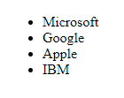

2. Нумерованный список создаётся с помощью элемента `<ol>`...`</ol>`. Каждый пункт списка также создаётся с помощью элемента `<li>`. 
Браузер нумерует элементы по порядку автоматически и если удалить один или несколько элементов такого списка, то 
остальные номера будут автоматически пересчитаны.

```html
<ol>
  <li>Microsoft</li>
  <li>Google</li>
  <li>Apple</li>
  <li>IBM</li>
</ol>
```
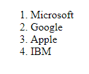

3. Списки определений создаются с помощью элемента `<dl>`...`</dl>`. Для добавления термина применяется элемент `<dt>`, 
а для вставки определения — элемент `<dd>`.

```html
<dl>
  <dt>Директор:</dt>
    <dd>Иван Иванов</dd>
  <dt>Сотрудники:</dt>
    <dd>Петр Петров</dd>
    <dd>Илья Ильин</dd>
    <dd>Максим Максимов</dd>
</dl>
```
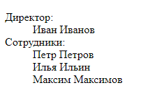


4. Вложенный список. Разметка для вложенного списка - это комбинирование списков, например:

```html
<ul>
 <li>Пункт 1.</li>
  <li>Пункт 2.
    <ul>
      <li>Подпункт 2.1.</li>
       <li>Подпункт 2.2.     
        <ul>
          <li>Подпункт 2.2.1.</li>
          <li>Подпункт 2.2.2.</li>
          </ul>
       </li>          
      <li>Подпункт 2.3.</li>
    </ul>
  </li>
 <li>Пункт 3.</li>
</ul>
```

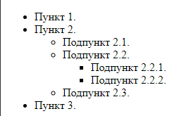

## Элементы работы со таблицей

[Подробнее](https://html5book.ru/tablichnye-dannye/)

Начала будут приведены элементы таблицы, а затем пример с использованием этих элементов.

* `<table>`...`</table>` - представляет табличные данные, то есть информацию, представленную в двумерной таблице, состоящей из строк 
и столбцов ячеек, содержащих данные.

* `<caption>`...`</caption>` - участвует в макете таблицы, добавляя заголовок таблице, что значительно упрощает ее понимание.

* `<colgroup>`...`</colgroup>` и его атрибут `span` участвует в макете таблицы, представляя группу из одного или нескольких столбцов.

* `<col>` и его атрибут `span` участвует в макете таблицы, представляя один или несколько столбцов в группе столбцов, 
представленных элементом `<colgroup>`

* `<tbody>`...`</tbody>` - участвует в макете таблицы, представляя собой блок строк, состоящий из основных данных таблицы.

* `<thead>`...`</thead>` - участвует в макете таблицы, представляя собой блок строк, состоящий из заголовков столбцов таблицы.

* `<tfoot>`...`</tfoot>` - участвует в макете таблицы, представляя собой блок строк, состоящий из нижних колонтитулов.

* `<tr>`...`</tr>` - участвует в макете таблицы, представляя собой строку ячеек в таблице

* `<td>`...`</td>` - представляет собой ячейку данных в таблице

* `<th>`...`<th>` определяет ячейку как заголовок группы ячеек таблицы

В итоге `<tr>` и `<th>` это группы ячеек, а сами данные в ячейке находятся в `<td>`

Пример таблицы заказа в интернет-магазине. Про используемый атрибут `style` поговорим в разделе кастомизации.

```html
<table>
        <caption>Заказ интернет-магазина</caption>
        <colgroup>
            <col style="width: 20%;">
            <col style="width: 40%;">
            <col style="width: 20%;">
            <col style="width: 20%;">
        </colgroup>
        <thead>
            <tr>
                <th>Номер товара</th>
                <th>Наименование товара</th>
                <th>Цена (USD)</th>
                <th>Количество</th>
            </tr>
        </thead>
        <tbody style="background: lightblue">
            <tr>
                <td>101</td>
                <td>Смартфон</td>
                <td>500</td>
                <td>2</td>
            </tr>
            <tr>
                <td>202</td>
                <td>Ноутбук</td>
                <td>800</td>
                <td>1</td>
            </tr>
            <tr>
                <td>303</td>
                <td>Планшет</td>
                <td>300</td>
                <td>3</td>
            </tr>
        </tbody>
        <tfoot>
            <tr style="background: lightgray">
                <td colspan="2">Итого:</td>
                <td>2700</td>
                <td>6</td>
            </tr>
        </tfoot>
    </table>
```
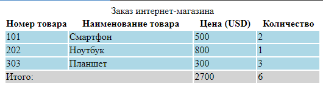

## Элементы, формирующие разделы HTML-документа

[Подробнее](https://html5book.ru/razdely-dokumenta/)

Разделы своего рода контейнеры, для описания структуры файла. В самих контейнерах уже формируются блоки с основной 
информацией на странице.

* `<body>`...`</body>` - представляет содержимое документа.


* `<article>`...`</article>` - представляет собой законченное или автономное произведение в документе, странице, приложении или сайте.


* `<section>`...`</section>` - представляет общий раздел документа или приложения, группируя тематическое содержимое. Примерами разделов 
могут быть главы, различные страницы во вкладках или пронумерованные разделы. Домашняя страница веб-сайта может быть разбита на разделы для введения, новостей и контактной информации.


* `<nav>`...`</nav>` - представляет собой раздел страницы с навигационными ссылками, который ссылается на другие страницы или 
части внутри страницы, при этом необязательно должен находиться внутри `<header>`. На странице может быть несколько элементов `<nav>`.


* `<aside>`...`</aside>` - представляет раздел страницы, который состоит из содержимого, косвенно связанного с родительским секционным 
элементом и который можно рассматривать отдельно от него. Чаще всего элемент позиционируется как боковая колонка 
(как в книгах) и включает в себя группу элементов: <nav>, цифровые данные, цитаты, рекламные блоки, архивные записи и т.д.


* `<header>`...`</header>` - представляет вводное содержимое для его ближайшего предка — элемента `<main>` или элемента из категории 
секционного содержимого или корневого секционного элемента. Элемент `<header>` обычно содержит группу вводных или навигационных элементов.


* `<footer>`...`</footer>` - представляет нижний колонтитул для его ближайшего предка элемента `<main>`, или элемента из категории 
секционного содержимого или корневого секционного элемента.


В общем виде типовое назначение разделов можно изобразить так

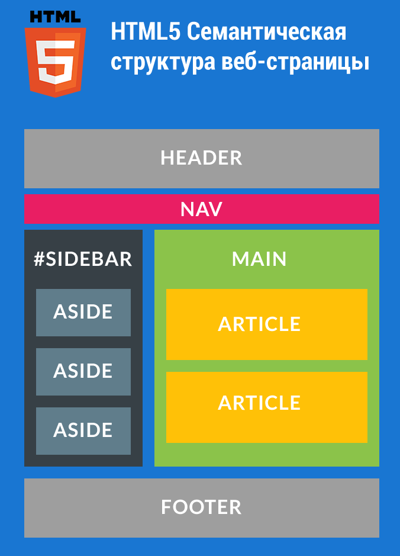

или так

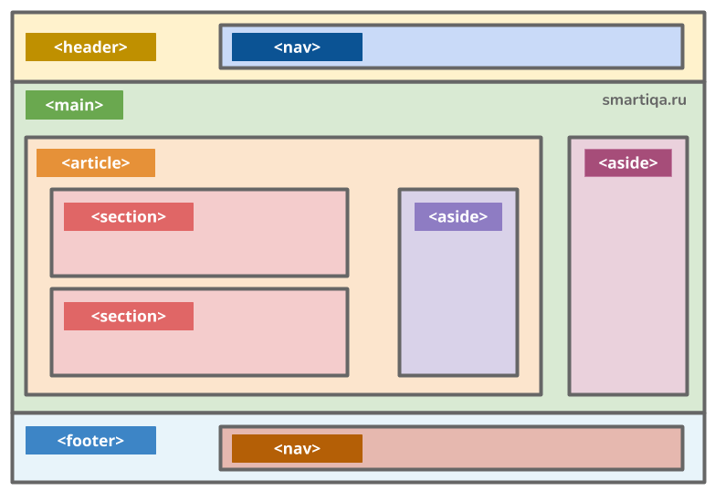

Пример верстки блока с использованием тегов приведенных выше

```html
<!DOCTYPE html>
<html lang="en">
<head>
    <meta charset="UTF-8">
    <meta name="viewport" content="width=device-width, initial-scale=1.0">
    <title>Пример блога</title>
</head>
<body>
    <header>
        <h1>Мой блог</h1>
        <nav>
            <ul>
                <li><a href="/">Главная</a></li>
                <li><a href="/категория1">Категория 1</a></li>
                <li><a href="/категория2">Категория 2</a></li>
                <li><a href="/о-нас">О нас</a></li>
                <li><a href="/контакты">Контакты</a></li>
            </ul>
        </nav>
    </header>

    <main>
        <article>
            <header>
                <h2>Заголовок статьи 1</h2>
                <p>Автор: Имя автора</p>
            </header>
            <section>
                <p>Это текст статьи 1.</p>
            </section>
            <footer>
                <p>Опубликовано: 1 января 2023 года</p>
            </footer>
        </article>

        <article>
            <header>
                <h2>Заголовок статьи 2</h2>
                <p>Автор: Другое имя автора</p>
            </header>
            <section>
                <p>Это текст статьи 2.</p>
            </section>
            <footer>
                <p>Опубликовано: 5 февраля 2023 года</p>
            </footer>
        </article>
    </main>

    <aside>
        <h3>Популярные статьи</h3>
        <ul>
            <li><a href="/популярная-статья-1">Популярная статья 1</a></li>
            <li><a href="/популярная-статья-2">Популярная статья 2</a></li>
            <li><a href="/популярная-статья-3">Популярная статья 3</a></li>
        </ul>
    </aside>

    <footer>
        <p>&copy; 2023 Мой блог. Все права защищены.</p>
    </footer>
</body>
</html>
```

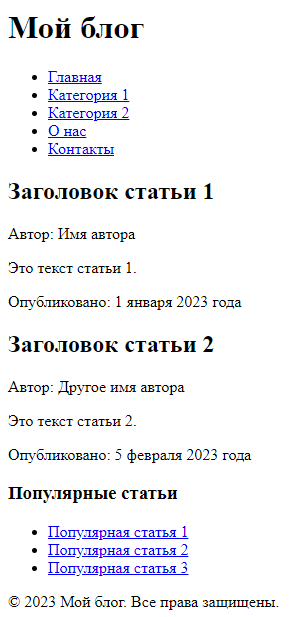

## Элементы группировки

[Подробнее](https://html5book.ru/gruppirovka-soderzhimogo/)

Самое время поговорить как можно сгруппировать блок элементов внутри контейнера, это полезно для того, чтобы применять 
какие-то действия для всех элементов внутри этого контейнера, допустим одинаковый шрифт, цвет или другие действия.

* `<div>`...`</div>` - самый часто встречаемый блок группировки, представляет свои дочерние элементы. 
Может использоваться с атрибутами class, lang и title для разметки семантики, общей для группы последовательных элементов.

Рекомендуется использовать элемент `<div>` в случаях, когда другой элемент не подходит. 
Использование более подходящих элементов вместо элемента `<div>` обеспечивает лучшую доступность для читателей и облегчает обслуживание кода.

С другой стороны, элемент `<div>` может быть полезны для стилистических целей или для обертывания нескольких абзацев 
внутри раздела, имеющих общие свойства. 

* `<span>`...`</span>` - не является элементом группировки, но может быть полезен при использовании вместе с глобальными атрибутами, 
например, class, lang или dir. Удобно применять для кастомизации отдельных частей текста.


* `<main>`...`</main>` - включает основное содержимое элемента `<body>` документа или приложения и исключает содержимое, 
которое повторяется на страницах сайта/приложения, таких как ссылки для навигации по сайту, 
информация об авторских правах, логотипы сайта и баннеры, а также поисковые формы (за исключением случаев, когда 
основной функцией документа или приложения является поисковая форма).

В документе должно быть не более одного элемента `<main>`.

* `<address>`...`</address>` - представляет контактную информацию о человеке или организации. 
Он должен включать физическое и / или цифровое местоположение / контактную информацию и средства идентификации лица (лиц) 
или организации, к которой относится эта информация. В браузере обычно отображается курсивом.

* `<blockquote>`...`</blockquote>` - представляет содержимое, цитируемое из другого источника, необязательно со ссылкой на источник цитирования, 
которая указывается в элементе `<footer>` или `<cite>`, и, необязательно, с изменениями по тексту, такими как аннотации и сокращения.

```html
<address>
Санкт-Петербург 195251<br>
ул. Обручевых , д. 1, комн. 202<br>
(11–ый учебный корпус СПбПУ)<br>
Тел.: +7 (812) 703-02-02 | Почта: info@hse.spbstu.ru
</address>

<blockquote>
    <p>От перца, верно, начинают всем перечить... От уксуса - куксятся, от горчицы - огорчаются, от лука - лукавят,
        от вина - винятся, а от сдобы - добреют. Как жалко, что никто об этом не знает... Всё было бы так просто!
        Ели бы сдобу и добрели!</p>
    <cite>Льюис Кэрролл. Приключения Алисы в Стране чудес</cite>
</blockquote>
```

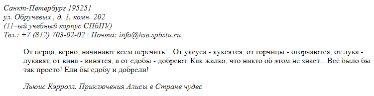


* `<figure>`...`</figure>` - представляет автономное содержимое (необязательно с подписью), являющееся самостоятельным элементом 
основного потока. С помощью элемента `<figure>` можно добавлять краткие характеристики к иллюстрациям, фотографиям, 
диаграммам, фрагментам кода и т.д.

* `<figcaption>`...`</figcaption>` - представляет заголовок или легенду для остального содержимого родительского элемента `<figure>`.
```html
<figure>
    
    <figcaption>Осенний лес</figcaption>
</figure>
```


## Атрибуты, кастомизация элементов, работа с цветом и шрифтом и т.д.

Для работы с цветом и шрифтом, да и вообще кастомизацией элементов можно использовать атрибут `style`, где прописать что конкретно изменяете

HTML-атрибуты это специальные слова, которые управляют поведением HTML-элемента. 
Они добавляют дополнительную функциональность, либо меняют поведение элемента по умолчанию.
Атрибуты прописываются внутри открытого элемента после его названия и до закрытия скобки `>`.

Допустим 

```html
<p style="color: red;">
    Этот текст будет красным, а тут <b>жирно красным</b>
</p>
<p style="font-family: Arial, sans-serif; font-size: 26px;">
    Этот текст будет в шрифте Arial размером 26px.
</p>
<p style="font-family: Arial, sans-serif; font-size: 26px;">
    Внутри также можно менять элементы, если они поддерживают атрибуты.
    Допустим как
    <span style="color: green;">H</span>
    <sub style="color: red;">2</sub>
    <span style="color: orange;">O</span>
</p>
```

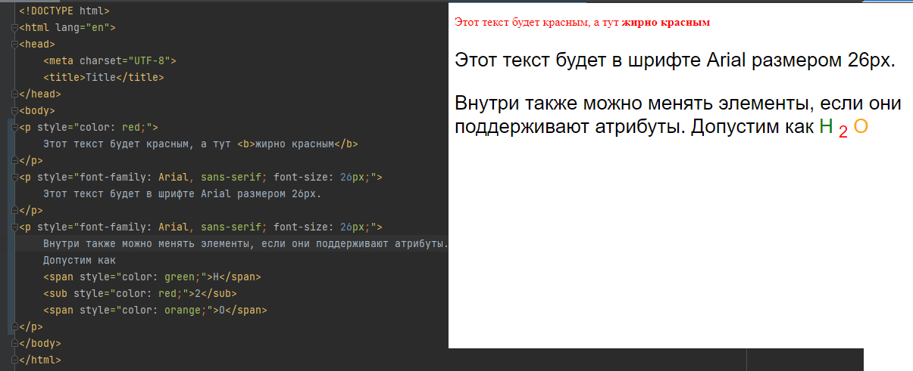


Также есть элемент `<style>`(`</style>`) в который можно записать все стили элементов,
внутри можно более полноценно кастомизировать элементы и ссылаться на них. Однако,
при большом числе стилей, рекомендуется данные стили выносить в отдельный файл css, 
а затем этот css подгружать в файл HTML.

Пример использования элемента `<style>` где пропишем все стили для соответствующих `id`. Результат будет аналогичен

```html
<style>
    #text_red {
    color: red;
    }
    #font_arial {
    font-family: Arial, sans-serif;
    font-size: 26px;
    }

    #color_red {color: red}
    #color_green {color: green}
    #color_orange {color: orange}
</style>
<p id="text_red">
    Этот текст будет красным, а тут <b>жирно красным</b>
</p>
<p id="font_arial">
    Этот текст будет в шрифте Arial размером 26px.
</p>
<p id="font_arial">
    Внутри также можно менять элементы, если они поддерживают атрибуты.
    Допустим как
    <span id="color_green">H</span>
    <sub id="color_red">2</sub>
    <span id="color_orange"style="color: orange;">O</span>
</p>
```

Вернёмся к атрибутам, в общем виде атрибуты можно разделить на универсальные(их ещё называют глобальные), 
уникальные, специфические и событийные

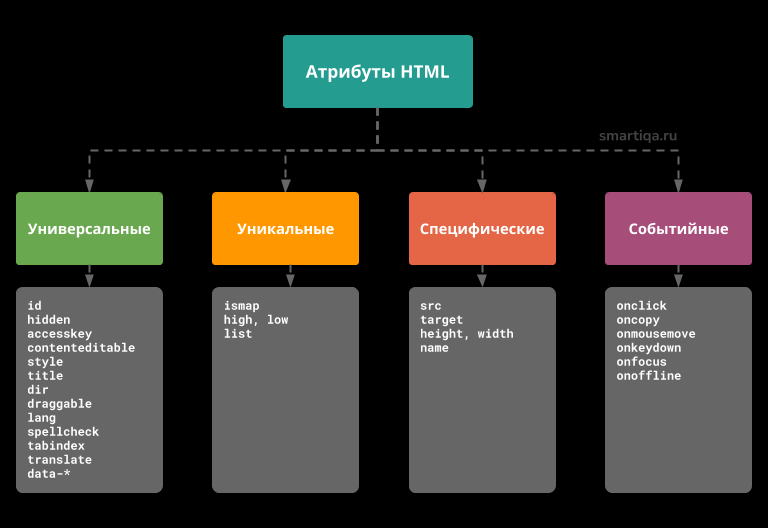


### Универсальные атрибуты

Исходя из названия такого рода свойства присущи каждому тегу в HTML. 
Никто не запрещает «навешивать» их налево и направо, но это не всегда разумно. 
В любом случае, если универсальный атрибут применен «не к месту», он не возымеет никакого действия, и, 
что хорошо, не приведет к ошибке. 

*Перечень универсальных атрибутов:*

* `accesskey` - Значение атрибута используется браузером в качестве руководства для создания сочетания клавиш, 
которое активирует или фокусирует элемент. Состоит из разделенного пробелами списка символов. 
Браузер в первую очередь выбирает те клавиши, которые существуют на раскладке клавиатуры.


* `autocapitalize` - Дает подсказку браузеру, каким образом вводимый текст будет автоматически писаться с заглавной буквы при 
вводе/редактировании пользователем. Атрибут не влияет на поведение при наборе текста на физической клавиатуре, 
только на поведение других механизмов ввода, таких как виртуальные клавиатуры на мобильных устройствах и голосовой ввод. 
Атрибут autocapitalize никогда не приводит к автоматическому включению заглавных букв для элемента 
`<input>` типа `url`, `email` или `password`. Разрешенные значения:

  * `off` или `none` — все буквы по умолчанию в нижнем регистре.

  * `on` или `sentences` — первая буква каждого предложения по умолчанию заглавная; все остальные буквы по умолчанию в нижнем регистре.

  * `words` — первая буква каждого слова по умолчанию заглавная; все остальные буквы по умолчанию в нижнем регистре.

  * `characters` — все буквы по умолчанию должны быть в верхнем регистре.


* `autofocus` - Логический атрибут, указывающий, что элемент должен быть сфокусирован при загрузке страницы или при отображении <dialog>, частью которого он является. Не более одного элемента в документе или диалоговом окне может иметь атрибут autofocus. Если применить к нескольким элементам, то фокус получит первый из них.


* `class` - Представляет собой разделенный пробелом список классов элемента с учетом регистра. Классы позволяют CSS и Javascript выбирать и получать доступ к элементам с помощью селекторов классов или функций, таких как метод DOM document.getElementsByClassName.


* `contenteditable` - Указывает, может ли элемент быть доступным для редактирования пользователем. Цвет курсора в области редактирования можно изменить с помощью CSS-свойства caret-color.

  * `true` или пустая строка — элемент доступен для редактирования.

  * `false` — элемент недоступен для редактирования.
 

* `data-*` - Создает пользовательские атрибуты данных, которые позволяют сценариям обмениваться информацией между HTML и его представлением DOM. 
Доступ к ним дает свойство `HTMLElement.dataset`. Символ * может быть заменен любым именем в соответствии с правилом создания имен XML со следующими ограничениями:
  * имя не должно начинаться с xml (без учета регистра).
  * имя не должно содержать двоеточие :.
  * имя не должно содержать заглавных букв.

Синтаксис: ``

* `dir` - Указывает направление текста элемента. Является обязательным для элемента `<bdo>`. Разрешенные значения:

  * `ltr` — слева направо и должно использоваться для языков, которые пишутся слева направо (например, английский).

  * `rtl` — справа налево и должно использоваться для языков, которые пишут справа налево (например, арабский).

  * `auto` — позволяет браузеру использовать базовый алгоритм, который анализирует символы внутри элемента, пока не найдет символ с сильной направленностью, а затем применяет эту направленность ко всему элементу.


* `draggable` - Указывает, можно ли перетаскивать элемент либо с помощью собственного поведения браузера, 
либо с помощью HTML Drag and Drop API. Разрешенные значения:

  * `true` — элемент можно перетаскивать.

  * `false` — элемент нельзя перетащить.

  * `auto` — значение по умолчанию, означает, что поведение перетаскивания является поведением браузера по умолчанию: 
перетаскивать можно только выделенный текст, изображения и ссылки.


* `enterkeyhint` - Указывает, какой текст или значок должен отображаться на клавише ввода виртуальной клавиатуры. Разрешенные значения:

  * `enter` — символ новой строки.

  * `done` — текст, означающий, что больше нечего вводить, и редактор метода ввода (IME) будет закрыт.

  * `go` — текст, означающий, что пользователь должен перейти к цели введенного им текста.

  * `next` — текст, означающий, что пользователь должен перейти к следующему полю, которое будет принимать текст.

  * `previous` — текст, означающий, что пользователь должен перейти в предыдущее поле, которое будет принимать текст.

  * `search` — текст, означающий, что пользователь должен перейти к результатам поиска введенного им текста.

  * `send` — текст, означающий, что пользователь должен отправить введенный текст.


* `hidden` - Указывает браузеру, что элемент должен быть скрыт.


* `id` - Определяет уникальный идентификатор элемента. Его цель — идентифицировать элемент при связывании 
(используя идентификатор фрагмента — якорь), сценарии или стилизации с помощью CSS. Значение `id` не должно содержать пробелов. 
В отличие от атрибута `class`, элементы могут иметь только одно единственное значение идентификатора.


* `inputmode` - Указывает, какой механизм ввода будет наиболее полезен для пользователей, что позволяет браузеру отображать 
соответствующую виртуальную клавиатуру. Браузеры могут поддерживать данный атрибут в элементах управления формы, например, `<textarea>`, или в элементах, 
для которых задан атрибут `contenteditable`. Разрешенные значения:

  * `none` — виртуальная клавиатура не отображается.

  * `text` — значение по умолчанию, отображается виртуальная клавиатура для ввода текста.

  * `decimal` — отображается клавиатура для ввода дробных чисел, содержащая цифры и десятичный разделитель для языкового 
стандарта пользователя (обычно . или ,). Устройства могут отображать или не отображать клавишу -.

  * `numeric` — отображается цифровая клавиатура ввода. Устройства могут отображать или не отображать клавишу -. 
Это ключевое слово полезно для ввода PIN-кода.

  * `tel` — отображается клавиатура с возможностью ввода номера телефона. Она включает клавиши для цифр от 0 до 9, символ # и *. Поля, для которых требуется 
номер телефона, обычно должны использовать вместо этого `<input type="tel">`.

  * `search` — отображается клавиатура, оптимизированная для поиска. Например, клавиша возврата/отправки может быть помечена как «Поиск» 
вместе с возможными другими оптимизациями. Поля, требующие поискового запроса, должны использовать вместо этого `<input type="search">`.

  * `email` — отображается клавиатура, оптимизированная для ввода адресов электронной почты, например, с символами @ и .. Для полей, которым требуются адреса 
электронной почты, следует использовать `<input type="email">`.

  * `url` — отображается клавиатура, оптимизированная для ввода URL-адресов, например, с символами / и . и строками www. или .com. Для полей, которым 
требуется URL-адрес, вместо этого обычно следует использовать `<input type="url">`.


* `is` - Атрибут является частью спецификации пользовательских элементов, он указывает, что существующий стандартный элемент 
на самом деле является пользовательским элементом, а значение атрибута задает его имя.


* `itemid` - Предоставляет микроданные в виде уникального глобального идентификатора элемента. Например, книги можно идентифицировать по номеру ISBN. 
Словари, определяемые атрибутом `itemtype`, могут быть разработаны таким образом, чтобы элементы однозначно ассоциировались со своим глобальным идентификатором, 
выражая глобальные идентификаторы в виде URL-адресов, заданных в атрибуте `itemid`. Точное значение URL-адресов, указанных в `itemid`, зависит от используемого словаря.

Атрибут может быть указан только для элемента, для которого заданы атрибуты `itemscope` и `itemtype`.


* `itemprop` - Описывает свойства сущности.


* `itemref` - Свойства, которые не являются потомками элемента с атрибутом `itemscope`, могут быть связаны с элементом с помощью глобального атрибута `itemref`. 
itemref предоставляет список идентификаторов элементов (не itemid) в другом месте документа с дополнительными свойствами. 
Атрибут может быть указан только для элементов, для которых указан атрибут itemscope.

Атрибут itemref не является частью модели данных микроданных. Это просто синтаксическая конструкция, помогающая авторам добавлять аннотации к страницам, 
где аннотируемые данные не соответствуют древовидной структуре. Например, он позволяет авторам размечать данные в таблице, чтобы каждый столбец определял 
отдельный элемент, сохраняя свойства в ячейках.


* `itemscope` - Используется для установки области, указывая, что HTML-код, содержащийся в данном блоке, описывает 
некоторую сущность, заданную `itemtype`.


* `itemtype` - Указывает тип сущности, описанной в словаре по данному url.


* `lang` - Указывает основной язык для содержимого элемента и для любого из атрибутов элемента, содержащих текст. 
Его значение должно быть допустимым языковым тегом BCP 47 или пустой строкой. Установка для атрибута пустой строки означает, 
что основной язык неизвестен.


* `nonce` - Определяет криптографический одноразовый номер, который может использоваться политикой безопасности 
контента для определения того, будет ли разрешена данная выборка для данного элемента. Атрибут полезен для включения 
элементов, таких как встроенный `<script>` или `<style>` в список разрешенных, что поможет избежать использования 
директивы CSP unsafe-inline.


* `slot` - Используется для назначения слота элементу.


* `spellcheck` - Определяет, может ли элемент быть проверен на наличие орфографических ошибок, 
является просто подсказкой для браузера. Если этот атрибут не установлен, его значение по умолчанию определяется типом 
элемента и браузером. Разрешенные значения:

  * `true` — элемент должен быть по возможности проверен на наличие орфографических ошибок.

  * `false` — элемент не следует проверять на орфографические ошибки.


* `style` - Содержит объявления стилей CSS, которые следует применить к элементу. 
Рекомендуется определять стили в отдельном файле или файлах. Этот атрибут и элемент `<style>` в основном предназначены 
для быстрой настройки стилей, например, для целей тестирования.


* `tabindex` - Указывает, что элемент может быть сфокусирован для перемещения вперед через последовательно фокусируемые области (обычно с помощью клавиши Tab). 
Атрибут `tabindex`, если он указан, должен иметь целое значение. Возможные значения:

  * `Отрицательное значение` означает, что элемент недоступен с помощью последовательной навигации с клавиатуры, 
но его можно сфокусировать с помощью JavaScript или визуально, щелкнув мышью.

  * `Нулевое значение` означает, что элемент должен находиться в фокусе при последовательной навигации
с помощью клавиатуры после любых положительных значений `tabindex`, а его порядок определяется исходным порядком документа.

  * `Положительное значение` означает, что элемент должен находиться в фокусе при последовательной 
навигации с помощью клавиатуры, а его порядок определяется значением числа.


* `title` - Содержит дополнительную информацию об элементе, задавая всплывающую подсказку для страницы. 
Атрибут `title` может содержать несколько строк, каждый символ перевода строки добавляет ее разрыв. 
Если элемент не имеет атрибута `title`, то он наследует его от своего родительского элемента, который, 
в свою очередь, может наследовать его от своего родительского элемента и так далее. 
Если для этого атрибута задана пустая строка, это означает, что заголовки его родительских элементов не будут 
отображаться для этого элемента.


* `translate` - Указывает, следует ли переводить переводимые значения атрибута элемента и его дочерние текстовые узлы при переводе страницы. 
Хотя не все браузеры распознают этот атрибут, он учитывается системами автоматического перевода, такими как Google Translate, 
а также может учитываться инструментами, используемыми людьми-переводчиками. Поэтому важно, чтобы веб-авторы использовали этот атрибут, 
чтобы пометить контент, который не следует переводить. Разрешенные значения:

  * `yes` или пустая строка — элемент должен быть переведен при переводе страницы.

  * `no` — элемент не должен быть переведен.

### Уникальные атрибуты

Характерны только для одного элемента. Приведем несколько примеров:

* `ismap` - Имеется только у тега `` (позволяет получать координаты клика по картинке);


* `list` - Принадлежит элементу `<input>` – указывает на `id` списка, из элементов которого 
можно выбирать значения для выбранного поля формы.

### Специфические атрибуты 

Существенная часть атрибутов относится не к одному тегу, а к нескольким.

* `src` - Ссылка на источник медиа-файла (применим к тегам: `<audio>`, `<embed>`, `<iframe>`, ``, `<input>`, `<script>`, 
`<source>`, `<track>`, `<video>`).


* `target` - Задает источник целевого открытия ссылки или валидации формы. 
Актуально для элементов: `<a>`, `<area>`, `<base>`, `<form>`. 
Может принимать следующие значения: 
  * `_blank` (откроется новая вкладка в браузере), 
  * `_self` (останемся на текущей вкладке), 
  * `_parent` (загрузка в родительский фрейм, если страница на них разделена), 
  * `_top` (несмотря на наличие фреймов они все закроются, а ссылка откроется на всё окно браузера)


* `height`, `width` - Определяют высоту и ширину элемента. Применимы для тегов `<canvas>`, `<embed>`, `<iframe>`, ``, 
`<input>`, `<object>`, `<video>`. 
Значения – положительные числа (трактуются как пиксели). 
Можно использовать и проценты - считаются относительно родительского элемента.


* `name` - Для задания имени элемента. Применяется для следующих тегов: `<button>`, `<fieldset>`, `<form>`, 
`<iframe>`, `<input>`, `<map>`, `<meta>`, `<object>`, `<output>`, `<param>`, `<select>`, `<textarea>`. По этому названию к 
объекту можно обращаться через JavaScript, например. 

#### Событийные атрибуты

Связаны с JavaScript-событиями. При взаимодействии пользователя с элементами эти события могут срабатывать 
и изменять поведение объектов. Удобно для динамического изменения объекта при контакте с пользователем. 

Некоторые атрибуты:

* `onclick` - Скрипт срабатывает при клике мышкой по элементу (можно вызвать всплывающее окно, 
изменить размер или цвет, перенаправить на другую страницу и т.п.).

* `oncopy` - Вызывает скрипт при попытке скопировать содержимое элемента (таким способом часто 
запрещают копировать содержимое либо добавляют ссылку на первоисточник, когда вы вставляете 
скопированное в текстовый редактор).

* `onmousemove` - Эффект при движении мыши (позволяет создавать интересные эффекты на 
странице: смещение, увеличение, тряску и т.п.).

* `onkeydown` - Обработка нажатия определенной клавиши.

* `onfocus` - Изменение поведения объекта при фокусе на нем 
(например, когда поставили курсор в поле для ввода логина, само поле может изменить цвет, стать больше, дать какую-то подсказку).

* `onoffline` - Поведение страницы в момент отсутствия активного подключения к сети 
(удобно, когда под рукой нет Интернета, а сайт продолжает функционировать, хоть и в ограниченном режиме).

## Элементы встраиваемого содержимого, работа с картинками, видео, аудио

### Работа с картинками

Подробнее про [картинки](https://html5book.ru/images-in-html/)

* `` - представляет изображение и его резервный контент, который добавляется с помощью атрибута `alt`. 
Так как элемент `` является строчным, то рекомендуется располагать его внутри блочного элемента, например, `<p>` или `<div>`.

Элемент `` имеет обязательный атрибут `src`, значением которого является абсолютный или относительный путь к изображению

```html
<p>
    
</p>
```
* `<map>` - служит для представления графического изображения в виде карты с активными областями. 
Активные области определяются по изменению вида курсора мыши при наведении. Щелкая мышью на активных областях, 
пользователь может переходить к связанным документам.

* `<area>` - описывает только одну активную область в составе карты изображений на стороне клиента. 
Если одна активная область перекрывает другую, то будет реализована первая ссылка из списка областей.

### Пример создания карты изображений

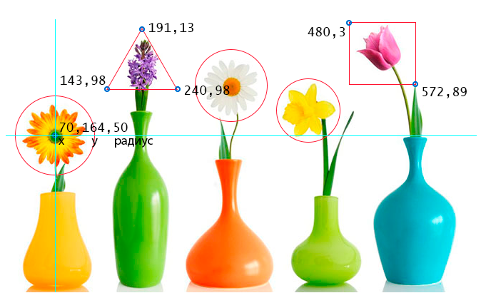

Можете подставить код в `example.html` и посмотреть, что выйдет

```html

<map name="flowers">
<area shape="circle" coords="70,164,50" href="https://ru.wikipedia.org/wiki/Гербера" alt="gerbera" target="_blank">
<area shape="poly" coords="191,13,240,98,143,98,191,13" href="https://ru.wikipedia.org/wiki/%C3%E8%E0%F6%E8%ED%F2" alt="hyacinth" target="_blank">
<area shape="circle" coords="318,93,50" href="https://ru.wikipedia.org/wiki/Ромашка" alt="camomiles" target="_blank">
<area shape="circle" coords="425,129,45" href="https://ru.wikipedia.org/wiki/Нарцисс_(растение)" alt="narcissus" target="_blank">
<area shape="rect" coords="480,3,572,89" href="https://ru.wikipedia.org/wiki/Тюльпан" alt="tulip" target="_blank">
</map>
```

### Работа с видео

Подробнее про [видео](https://html5book.ru/html5-video/)

В простом варианте HTML-разметка для размещения видеофайла на странице имеет следующий вид:

```html
<video src="video.ogv" controls></video> 
```
Атрибут `controls` отвечает за появление элементов управления видеоплеером. Вы можете добавить изображение с помощью 
атрибута `poster`, которое браузер будет использовать, пока загружается видео или пока пользователь не нажмет на кнопку 
воспроизведения, а также задать высоту и ширину видео.

### Работа со звуком

Подробнее про [аудио](https://html5book.ru/html5-audio/)

HTML5-элемент `<audio>` используется для внедрения звукового контента в веб-страницы. В общем виде HTML-разметка 
имеет следующий вид:

```html
<audio src="name.ogg" controls></audio>
```
Атрибут controls добавляет отображение браузерами интерфейса управления аудио плеера — кнопки воспроизведения, паузы, громкости.

### Контейнеры для встраиваемого содержимого

Подробнее про [встраиваемое содержимое](https://html5book.ru/vstraivaemoe-soderzhimoe/)

* `<picture>`...`</picture>` вместе с элементом `<source>` может использоваться для предоставления множественных источников изображения. 
Это дает браузеру возможность выбора оптимальной версии изображения, в зависимости от плотности пикселей экрана, 
размера области просмотра, формата изображения и других факторов. Если наиболее подходящей версии изображения среди 
элементов <source> найдено не будет, то будет отображен файл, указанный в резервном элементе .

```html
<picture>
  <source media="(min-width: 800px)"
          sizes="80vw"
          srcset="lighthouse-landscape-640.jpg 640w,
                  lighthouse-landscape-1280.jpg 1280w,
                  lighthouse-landscape-2560.jpg 2560w">
        
</picture>
```

* `<iframe>`...`</iframe>` - используется для встраивания другого HTML-документа в текущий, при этом он полностью изолирован от 
JavaScript и CSS родительского элемента.

```html
<iframe sandbox="allow-forms allow-modals" 
        allow="fullscreen" 
        src="https://youtu.be/">
</iframe>
```


* `<embed>` - используется для отображения внешних ресурсов или интерактивного контента. Элемент `<embed>` не подключает 
альтернативные ресурсы. Если браузер не находит подходящий плагин при попытке найти и создать экземпляр ресурса, 
то он выдаст сообщение о неподдерживаемом формате.

```html
<embed src="catgame.swf">
```


* `<object>`...`</object>` - представляет внешний ресурс, который, в зависимости от типа ресурса, будет рассматриваться либо как 
изображение, либо как вложенный контекст просмотра, либо как внешний ресурс, который будет обрабатываться плагином.

```html
<object type="application/x-shockwave-flash">
    <param name="movie" value="https://video.example.com/library/watch.swf">
    <param name="allowfullscreen" value="true">
    <param name="flashvars" value="https://video.example.com/vids/123456">
    <video controls src="https://video.example.com/vids/123456"
      <a href="https://video.example.com/vids/123456">View video</a>
    </video>
</object>
```

* `<param>` - определяет параметры плагинов, вызываемых элементом `<object>`

## Ссылки
Подробнее про [ссылки](https://html5book.ru/ssylki/)

Ссылки представляют связь между двумя ресурсами, одним из которых является 
текущий документ.
В HTML есть два вида ссылок:

* `Ссылки на внешние ресурсы` — это ссылки на ресурсы, которые должны использоваться 
для дополнения текущего документа (метаданные), обычно автоматически обрабатываемые браузером.
Ссылку на внешний объект создают с использованием элемента `<link>`.


* `Гиперссылки` — это ссылки на другие ресурсы, которые пользователь может посещать в браузере или загружать.
Гиперссылки чаще создают с использованием элемента `<a>`, однако в качестве ссылки можно использовать любой элемент 
у которого есть атрибут `href`.

### Гиперссылка*

`<a>`(`</a>`) - создаёт ссылку для перехода на нужный адрес. Для перехода необходимо нажать на текст ссылки

Если элемент `<a>` имеет атрибут `href`, то он представляет собой гиперссылку 
(ссылку на другой ресурс, к которому можно перейти или скачать) или якорь 
(ссылку на идентификатор фрагмента, который является значением в атрибуте id элемента в связанном документе).

Элемент `<a>` может быть обернут вокруг целых абзацев, списков, таблиц и т. д., 
даже целых разделов, при условии, что внутри отсутствует интерактивный контент 
(например, кнопки или другие ссылки).

```html
<aside class="advertising">
    <h2>Викиум</h2>
    <a href="https://ru.wikipedia.org">
        <section>
            <h3>Тренажеры для мозга</h3>
            <p>Какая функция мозга у тебя сильнее?</p>
        </section>
    </a>
</aside>
```

Атрибуты `<a>`:
* `href` - Задает адрес гиперссылки.
* `target` - Устанавливает контекст просмотра по умолчанию для навигации по гиперссылкам.
* `download` - Определяет, скачивать ли целевой ресурс вместо перехода на него.
* `rel` -	Устанавливает отношение текущего документа (или подраздела / темы) с целевым.
* `rev` -	Устанавливает обратную связь отношения целевой страницы с текущим документом (или подразделом / темой).
* `hreflang` - Описывает язык целевого ресурса.
* `type` - Добавляет подсказку для типа ссылочного ресурса.
* `referrerpolicy` - Устанавливает политику HTTP-заголовка — количество информации об исходной странице, с которой осуществлен переход на целевую страницу.

### Ссылка на внешний ресурс*

`<link>` определяет отношение между текущей страницей и другими документами. 
Таких элементов на странице может быть несколько.

Пример подгрузки HTML стилей
```html
<link rel="stylesheet" href="style.css" type="text/css">
```
Атрибуты `<link>` (чаще всего будете встречаться с `href` и `rel`):

* `crossorigin` - Указывает, должен ли использоваться CORS (технология браузеров, которая позволяет предоставить веб-странице доступ к ресурсам другого домена) при извлечении изображения с сайта.


* `hreflang` - Определяет язык текста в документе, на который идет ссылка.


* `media` - Определяет тип устройства, к которым должен быть применен ресурс ссылки.


* `nonce` -	Генерируемая случайным образом на сервере строковая переменная, которая устанавливает правила использования встроенных стилей с целью защиты контента.


* `rel` - Атрибут определяет отношения между текущим документом и документом, на который идет ссылка. Ниже возможные значения:
  * `alternate` — ссылка на тот же документ, но в другом формате (например, страницы для печати, перевод, зеркало, лента в формате RSS или Atom)
  * `archives` — указывает на то, что документ по ссылке представляет исторический интерес. Ссылка может указывать на коллекцию записей, документов и других материалов.
  * `author` - ссылка на страницу об авторе документа или на страницу с контактными данными автора.
  * `bookmark` - ссылка на ближайшего предка статьи, являющегося связующим звеном, или на раздел статьи, наиболее тесно связанных с элементом, если нет предка.
  * `external` - используется для указания того, что страница на которую ведет ссылка не являются частью данного сайта.
  * `first` - указывает ссылку, ведущую на первый документ из последовательности документов.
  * `help` - ссылка на документ со справкой.
  * `icon` - определяет путь к иконке, которая будет использована для текущего документа.
  * `last` - указывает ссылку, ведущую на последний документ в последовательности документов.
  * `license` - ссылка на сведения об авторских правах для документа.
  * `next` - указывает, что этот документ является частью серии, и что ссылка ведет на следующий документ в этой серии.
  * `nofollow` - указывает на то, что ссылка не одобрена автором страницы или что ссылка носит коммерческий характер.
  * `noreferrer` - указывает на то, что заголовок запроса клиента, содержащий url источника запроса, не должен передаваться при переходе по ссылке.
  * `pingback` - указывает адрес пингбэк-сервера, что дает возможность для блога автоматически оповещать сайты, ссылающиеся на него.
  * `prefetch` - указывает, что следует заранее кэшировать файл, на который ведет ссылка.
  * `prev` - указывает, что этот документ является частью серии, и что ссылка ведет на предыдущий документ в этой серии.
  * `search` - указывает, что ссылаемый документ содержит интерфейс поиска и связанных с ним ресурсов.
  * `sidebar` - указывает, что ссылаемый документ, если это возможно, будет показан в дополнительном контексте браузера, и некоторые браузеры при щелчке по гиперссылке открывают окно для добавления ссылки в панель закладок.
  * `stylesheet` - ссылка на внешний файл, который будет использоваться в качестве таблицы стилей для данного документа.
  * `tag` - указывает на то, что метка, на которую ведет гиперссылка, относится к данному документу.
  * `up` - указывает, что страница является частью иерархической структуры, и что гиперссылка ведет на более высокий уровень ресурса в структуре.
* `sizes` - Указывает размер иконок для визуального отображения. Атрибут sizes используется только совместно с rel="icon", и может принимать следующий значения:
* `title` - Определяет заголовок ссылки или название набора альтернативных таблиц стилей. Значение атрибута — текст.
* `type` - Определяет MIME-тип документа, на который идет ссылка. В данном случае он принимает значение "text/css".

## Интерактивные элементы(скрываемое содержимое; диалоговое окно)
Подробнее про [интерактивные элементы](https://html5book.ru/interaktivnye-elementy/)

* `<details>` - представляет виджет раскрытия информации, который используется, 
чтобы показать или скрыть дополнительную информацию в конкретной области интерфейса. 
Не подходит для примечаний. 

* `<summary>` - представляет заголовок или небольшое пояснение для остального 
содержимого родительского элемента `<details>`. Щелчок по элементу `<summary>` 
переключает состояние родительского элемента в открытое и закрытое состояния.

```html
<details>
  <summary><label for="fn">Name & Extension:</label></summary>
  <p><input type="text" id="fn" name="fn" value="Pillar Magazine.pdf">
  <p><label><input type="checkbox" name="ext" checked> Hide extension</label>
</details>
```
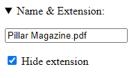

* `<dialog>` - представляет примитив графического интерфейса — диалоговое окно, 
с которым пользователь взаимодействует для выполнения конкретных задач.

Элемент `<dialog>` с помощью атрибута `method="dialog"` может интегрироваться с элементом `<form>`

```html
<dialog id="favDialog">
   <form method="dialog">
      <p>
         <label for="favAnimal">Любимые животные:</label>
         <select id="favAnimal">
            <option></option>
            <option>Вельш-корги</option>
            <option>Красная панда</option>
            <option>Рэгдолл</option>
         </select>
      </p>
      <p>
         <button id="cancel" type="reset">Отменить</button>
         <button type="submit">Отправить</button>
      </p>
   </form>
</dialog>
```

## Формы и их компоненты
Подробнее про [формы](https://html5book.ru/html5-forms/)

HTML-формы являются элементами управления, которые применяются для сбора информации от посетителей веб-сайта.

С формами вы встречаетесь постоянно, самый обычный пример, это форма регистрации на сайте, куда вы вносите свои данные
для регистрации, затем эти данные передаются на сервер.

Ниже приведён пример формы и теги формирующие элементы на форме

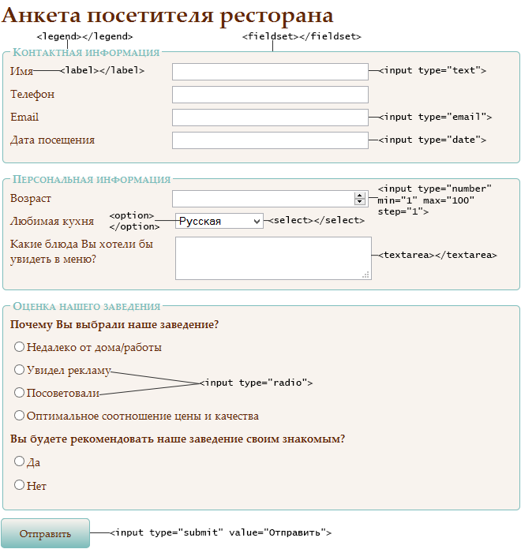


Описание формы начинается с элемента `<form>`...`</form>` он формирует форму, все элементы формы должны быть между тегами
формы. Атрибуты этого элемента содержат информацию, общую для всех полей формы, поэтому в одну форму нужно включать поля, 
объединенные логически.

Атрибуты `<form>`:

* `accept-charset` - Значение атрибута представляет собой разделенный пробелами список кодировок символов, которые будут 
использоваться для отправки формы, например, <form accept-charset="ISO-8859-1">.
* `action` - Обязательный атрибут, который указывает url обработчика формы на сервере, которому передаются данные. 
Представляет из себя файл (например, action.php) или url обработчика, в котором описано, что нужно делать с данными формы. 
Если значение атрибута не будет указано, то после перезагрузки страницы элементы формы примут значения по умолчанию.
В случае, если вся работа будет выполняться на стороне клиента сценариями JavaScript, то для атрибута action можно указать значение #.
* `autocomplete` - Отвечает за запоминание введенных в текстовое поле значений и автоподстановку их при последующем вводе:
  * `on` — означает, что поле не защищено, и его значение можно сохранять и извлекать,
  * `off` — отключает автозаполнение для полей форм.
* `enctype` - Используется для указания MIME-типа данных, отправляемых вместе с формой, например, enctype="multipart/form-data". Указывается только в случае method="post".
  * `application/x-www-form-urlencoded` — тип содержимого по умолчанию, указывает на то, что передаваемые данные представляют 
список URL-кодированных переменных формы. Символы пробела (ASCII 32) будут закодированы как +, а специальный символ, например, 
такой как ! будет закодирован шестнадцатиричной форме как %21.
  * `multipart/form-data` — используется для отправки форм, содержащих файлы, не-ASCII данные и бинарные данные, состоит 
из нескольких частей, каждая из которых представляет содержимое отдельного элемента формы.
  * `text/plain` — указывает на то, что передается обычный (не html) текст.
* `method` - Задает способ передачи данных формы.
  * `get` - передает данные на сервер через адресную строку браузера. При формировании запроса к серверу все переменные и их значения формируют последовательность вида www.anysite.ru/form.php?var1=1&var2=2. Имена и значения переменных присоединяются к адресу сервера после знака ? и разделяются между собой знаком &. Все специальные символы и буквы, отличные от латинских, кодируются в формате %nn, пробел заменяется на +. Этот метод нужно использовать, если вы не передаете больших объемов информации. Если вместе с формой предполагается отправка какого-либо файла, этот метод не подойдет.
  * `post` - применяется для пересылки данных больших объемов, а также конфиденциальной информации и паролей. Данные, отправляемые с помощью этого метода, не видны в заголовке URL, так как они содержатся в теле сообщения.
* `name` - Задает имя формы, которое будет использоваться для доступа к элементам формы через сценарии, например, name="opros".
* `novalidate` - Отключает проверку в кнопке для отправки формы. Атрибут используется без указания значения
* `target` - Указывает окно, в которое будет направлена информация:
  * `_blank` — новое окно
  * `_self` — тот же фрейм
  * `_parent` — родительский фрейм (если он существует, если нет — то в текущий)
  * `_top` — окно верхнего уровня по отношению к данному фрейму. Если вызов происходит не из дочернего фрейма, то в тот же фрейм.


### Элементы формы

#### 1.Базовое поле ввода

`<input>` - создает большинство полей формы. Атрибуты элемента отличаются в зависимости от типа поля, для создания 
которого используется этот элемент. С помощью css-стилей можно изменить размер шрифта, тип шрифта, цвет и другие 
свойства текста, а также добавить границы, цвет фона и фоновое изображение. Ширина поля задается свойством `width`.

Атрибуты `<input>`(чаще работают с атрибутами `type`, `name`, `value`, `required`):

* `accept` - Определяет тип файла, разрешенных для отправки на сервер. Указывается только для `<input type="file">`. Возможные значения:
  * `file_extension` — разрешает загрузку файлов с указанным расширением, например, `accept=".gif"`, `accept=".pdf"`, `accept=".doc"`
    * `audio/*` — разрешает загрузку аудиофайлов
    * `video/*` — разрешает загрузку видеофайлов
    * `image/*` — разрешает загрузку изображений
  * `media_type` — указывает на медиа-тип загружаемых файлов.


* `alt` - Определяет альтернативный текст для изображений, указывается только для `<input type="image">`.


* `autocomplete` - Отвечает за запоминание введенных в текстовое поле значений и автоподстановку их при последующем вводе:
  * `on` — означает, что поле не защищено, и его значение можно сохранять и извлекать,
  * `off` — отключает автозаполнение для полей форм.


* `autofocus` -	Позволяет сделать так, чтобы в загружаемой форме то или иное поле ввода уже имело фокус (было выбрано), являясь готовым к вводу значения.


* `checked` - Атрибут проверяет, установлен ли флажок по умолчанию при загрузке страницы для полей типа type="checkbox" и type="radio".


* `disabled` -	Отключает возможность редактирования и копирования содержимого поля.


* `form` -	Значение атрибута должно быть равно атрибуту id элемента <form> в этом же документе. Определяет форму, которой принадлежит данное поле.


* `formaction` -	Задает url файла, который будет обрабатывать введенные в поля данные при отправке формы. Задается только для полей типа type="submit" и type="image". Атрибут переопределяет значение атрибута action самой формы.


* `formenctype` - Определяет, как будут кодироваться данные полей формы при отправке на сервер. Переопределяет значение атрибута enctype формы. Задается только для полей типа type="submit" и type="image". Варианты:
  * `application/x-www-form-urlencoded` — значение по умолчанию. Все символы кодируются перед отправкой (пробелы заменяются на символ +, специальные символы преобразуются в значения ASCII HEX)
  * `multipart/form-data` — символы не кодируются
  * `text/plain` — пробелы заменяются на символ +, а специальные символы не кодируются.


* `formmethod` - Атрибут определяет метод, который браузер будет использовать для отправки данных формы на сервер. Задается только для полей типа type="submit" и type="image". Переопределяет значение атрибута method формы. Варианты:
  * `get` — значение по умолчанию. Данные из формы (пара имя/значение) добавляются в url-адрес и отправляются на сервер: URL?имя=значение&имя=значение
  * `post` — данные формы отправляются в виде http-запроса.


* `formnovalidate` - Определяет, что данные полей формы не должны проверяться при отправке формы. Переопределяет значение атрибута novalidate формы. Можно использовать без указания значения атрибута.


* `formtarget` - Определяет, где выводить ответ, полученный после отправки формы. Задается только для полей типа type="submit" и type="image". Переопределяет значение атрибута target формы.
  * `_blank` — загружает ответ в новое окно/вкладку
  * `_self` — загружает ответ в то же окно (значение по умолчанию)
  * `_parent` – загружает ответ в родительский фрейм
  * `_top` – загружает ответ во весь экран
  * `framename` – загружает ответ во фрейм с указанным именем.


* `height` - Значение атрибута содержит количество пикселей без указания единицы измерения. Устанавливает высоту поля формы 
типа `type="image"`, например, `<input type="image" src="img_submit.gif" height="50">`. Рекомендуется одновременно 
устанавливать как высоту, так и ширину поля.


* `list` - Является ссылкой на элемент `<datalist>`, содержит его `id`. Позволяет предоставить пользователю несколько 
вариантов на выбор, когда он начинает вводить значение в соответствующем поле.


* `max` -	Позволяет ограничить допустимый ввод числовых данных максимальным значением, значение атрибута может 
содержать целое или дробное число. Рекомендуется использовать этот атрибут вместе с атрибутом `min`. Работает со следующими
типами полей: `number`, `range`, `date`, `datetime`, `datetime-local`, `month`, `time` и `week`.


* `maxlength` -	Атрибут задает максимальное количество символов, вводимых в поле. Значение по умолчанию 524288 символов.


* `min` -	Позволяет ограничить допустимый ввод числовых данных минимальным значением.


* `multiple` -	Позволяет пользователю ввести несколько значений атрибутов, разделяя их запятой. Применяется в отношении 
файлов и адресов электронной почты. Указывается без значения атрибута.


* `name` -	Определяет имя, которое будет использоваться для доступа к элементу `<form>`, к примеру, в таблицах стилей css. 
Является аналогом атрибута id.


* `pattern` -	Позволяет определять с помощью регулярного выражения синтаксис данных, ввод которых должен быть разрешен 
в определенном поле. Например, `pattern="[a-z]{3}-[0-9]{3}"`


* `placeholder` -	Содержит текст, который отображается в поле ввода до заполнения (чаще всего это подсказка).


* `readonly` -	Не позволяет пользователю изменять значения элементов формы, выделение и копирование текста при этом доступно. 
Указывается без значения атрибута.


* `required` -	Выводит сообщение о том, что данное поле является обязательным для заполнения. Если пользователь 
попытается отправить форму, не введя в это поле требуемое значение, то на экране отобразится предупреждающее сообщение. 
Указывается без значения атрибута.


* `size` -	Задает видимую ширину поля в символах. Значение по умолчанию — 20. Работает со следующими типами 
полей: `text`, `search`, `tel`, `url`, `email` и `password`.


* `src`  -	Задает url изображения, используемого в качестве кнопки отправки данных формы. 
Указывается только для поля `<input type="image">`.


* `step` -	Используется для элементов, предполагающих ввод числовых значений, указывает величину увеличения или 
уменьшения значений в процессе регулировки диапазона (шаг).


* `type` (Значения, а рядом как выглядит отображение(всё интерактивное, можно нажимать и писать):
  * `button` — создает кнопку. `<input type='button' value="Нажми на меня">`
    
  <input type='button' value="Нажми на меня">

  * `checkbox` — превращает поле ввода во флажок, который можно установить или очистить, например, `<input type='checkbox'>`
  
  <input type='checkbox'>
  
  *  `color` — генерирует палитры цветов в поддерживающих браузерах, давая пользователям возможность выбирать значения 
цветов в шестнадцатеричном формате. `<input type='color'>`
  
  <input type='color'>

  * `date` — позволяет вводить дату в формате дд.мм.гггг. `<input type='date'>`
  
  <input type='date'>

  * `datetime-local` — позволяет вводить дату и время, разделенные прописной английской буквой Т по шаблону дд.мм.гггг чч:мм. 
`<input type='datetime-local'>`
  
  <input type='datetime-local'>

  * `email` — браузеры, поддерживающие данный атрибут, будут ожидать, что пользователь введет данные, соответствующие синтаксису 
адресов электронной почты. `<input type='email' placeholder="Введи email">`
  
  <input type='email' placeholder="Введи email">

  * `file` — позволяет загружать файлы с компьютера пользователя. `<input type='file'>`
  
  <input type='file'>

  * `hidden` — скрывает элемент управления, который не отображается браузером и не дает пользователю изменять 
значения по умолчанию. `<input type='hidden'>`
  
  <input type='hidden'>

  * `image` — создает кнопку, позволяя вместо текста на кнопке вставить изображение. `<input type='image'>`

  * `month` — позволяет пользователю вводить год и номер месяца по шаблону гггг-мм. `<input type='month'>`
  
  <input type='month'>
  
  * `number` — предназначено для ввода целочисленных значений. Его атрибуты min, max и step задают верхний, нижний пределы и шаг между значениями соответственно. Эти атрибуты предполагаются у всех элементов, имеющих численные показатели. Их значения по умолчанию зависят от типа элемента.
  Укажите количество (от 1 до 5): `<input type='number' value=1 min=1 max=5 step=1>`
  
  <input type='number' value=1 min=1 max=5 step=1>

  * `password` — создает текстовые поля в форме, при этом вводимые пользователем символы заменяются на звездочки, маркеры, 
  либо другие, установленные браузером значки. `<input type='password' placeholder='Введите пароль' name="pass">`

  <input type='password' placeholder='Введите пароль' name="pass">

  * `radio` — создает переключатель — элемент управления в виде небольшого кружка, который можно включить или выключить.
  `<input type='radio'>`
  
  <input type='radio'>

  * `range` — позволит создать такой элемент интерфейса, как ползунок, min / max — позволят установить диапазон выбора 

  <input type='range' min="0" max="100" value="50">

  * `reset` — создает кнопку, которая очищает поля формы от введенных пользователем данных.

  `<input type='reset' form="pass">`

  * `search` — обозначает поле поиска, по умолчанию поле ввода имеет прямоугольную форму. `<input type='search'>`

  <input type='search'>

  * `submit` — создает стандартную кнопку, активизируемую щелчком мыши. Кнопка собирает информацию с формы и отправляет ее 
  для обработки. `<input type='submit'>`

  <input type='submit'>

  * `text` — создает текстовые поля в форме, выводя однострочное текстовое поле для ввода текста. `<input type='text'>`
  
  <input type='text'>

  * `time` — позволяет вводить время в 24-часовом формате по шаблону чч:мм. В поддерживающих браузерах оно 
  отображается как элемент управления в виде числового поля ввода со значением, изменяемым с помощью мыши, и допускает 
  ввод только значений времени. `<input type='time'>`
  
  Укажите время: <input type='time'>

  * `url` — поле предназначено для указания URL-адресов. `<input type='url'>`
  
  Главная страница: <input type='url'>

  * `week` — соответствующий инструмент-указатель позволяет пользователю выбрать одну неделю в году, после чего обеспечит 
  ввод данных в формате нн-гггг. В зависимости от года число недель может быть 52 или 53. `<input type='week'>`
  
  Укажите неделю: <input type='week'>

* `value` -	Определяет текст, отображаемый на кнопке, в поле или связанный текст. Не указывается для полей типа `file`.


* `width` -	Значение атрибута содержит количество пикселей. Позволяет задать ширину полей формы.

#### 2.Текстовые поля ввода

`<textarea>`...`</textarea>` используется вместо элемента `<input type="text">`, когда нужно создать большие текстовые поля. Текст, отображаемый как исходное значение, помещается внутрь.

Размеры поля устанавливаются при помощи атрибутов `cols` – размеры по горизонтали, `rows` – размеры по вертикали. 
Высоту поля можно задать свойством `height`. Все размеры считаются исходя из размера одного символа моноширинного шрифта.

Атрибуты `<textarea>`:

* `autofocus` - Устанавливает фокус на нужном начальном текстовом поле автоматически.
* `cols` - Устанавливает ширину через количество символов. Если пользователь вводит больше текста, появляется полоса прокрутки.
* `disabled` - Отключает возможность редактирования и копирования содержимого поля.
* `form` - Значение атрибута должно быть равно значению атрибута `id` элемента `<form>` в этом же документе. Определяет одну или несколько форм, которым принадлежит данное текстовое поле.
* `maxlength` - Значение атрибута задает максимальное число символов для ввода в поле.
* `name` - Задает имя текстового поля.
* `placeholder` - Определяет короткую текстовую подсказку, которая описывает ожидаемое вводимое значение.
* `readonly` - Отключает возможность редактирования содержимого поля.
* `required` - Выводит сообщение о том, что данное поле является обязательным для заполнения.
* `rows` - Указывает число, которое означает, сколько строк должно отображаться в текстовой области.
* `wrap` - Определяет, должен ли текст сохранять переносы строк при отправке формы. 
Значение `hard` сохраняет перенос, а значение `soft` не сохраняет. Если используется значение `hard`, то должно 
указываться значение атрибута `cols`.

Пример отображения `<textarea>`

<textarea placeholder='введи текст'></textarea>

#### 3.Раскрывающийся список

Списки дают возможность расположить большое количество пунктов компактно. Раскрывающиеся списки создаются при помощи элемента 
`<select>...</select>`. Они позволяют выбрать одно или несколько значений из предложенного множества. По умолчанию в поле 
списка отображается его первый элемент.

Для добавления в список пунктов используются элементы `<option>...</option>`, которые располагаются внутри `<select>`.

Для систематизации списков применяется элемент `<optgroup>...</optgroup>`, который создает заголовки в списках.

Атрибуты `<select>`:

* `autofocus` - Устанавливает автоматический фокус на элементе при загрузке страницы.
* `disabled` - Отключает раскрывающийся список.
* `form` - Определяет форму, которой принадлежит данный список. В качестве значения атрибута указывается идентификатор формы.
* `multiple` - Дает возможность выбора одного или нескольких пунктов, для этого при выборе нужно нажать и удерживать нажатой клавишу Ctrl.
* `name` - Определяет имя для выпадающего списка. Значение атрибута содержит название, отражающее тематику списка.
* `required` - Выводит сообщение о том, что пользователь должен выбрать значение из раскрывающегося списка перед отправкой формы.
* `size` - Задает количество одновременно видимых на экране элементов списка. Если количество элементов списка превышает установленное количество, 
появляется полоса прокрутки. Значение атрибута задается целым положительным числом.

Атрибуты `<option>`:

* `disabled` - Делает недоступным для выбора элемент списка.
* `label` - Задает укороченную версию для элемента, которая будет отражаться в выпадающем списке. Значение атрибута содержит 
текст, описывающий соответствующий пункт выпадающего списка.
* `selected` - Отображает выбранный элемент списка по умолчанию при загрузке страницы браузером.
* `value` - Указывает значение, которое будет отправлено на сервер при отправке формы.


Атрибуты `<optgroup>`:

* `disabled` - Отключает данную группу элементов списка для выбора.
* `label` - Задает заголовок для группы элементов выпадающего списка. Значение атрибута содержит текст, недоступный для выбора, 
который будет располагаться над соответствующими пунктами списка. Текст выделяется в браузере жирным начертанием.


Пример

```html
<select>
    <optgroup label="цифры">
        <option>1</option>
        <option>2</option>
        <option>3</option>
    </optgroup>
    <optgroup label="буквы">
        <option>a</option>
        <option>b</option>
        <option>c</option>
    </optgroup>
</select>
```

<select>
    <optgroup label="цифры">
        <option>1</option>
        <option>2</option>
        <option>3</option>
    </optgroup>
    <optgroup label="буквы">
        <option>a</option>
        <option>b</option>
        <option>c</option>
    </optgroup>
</select>

#### 4.Надписи к полям формы

Надписи к элементам формы создаются с помощью элемента `<label>...</label>`. Существует два способа группировки надписи 
и поля. Если поле находится внутри элемента `<label>`, то атрибут for указывать не нужно.

Атрибуты `<label>`:

* `for` - Определяет, к какому полю формы привязан данный элемент. Можно создавать поясняющие надписи к следующим 
элементам формы: `<input>`, `<textarea>`, `<select>`. Значение атрибута содержит идентификатор поля формы.

Пример

```html
<!-- с указанием атрибута for -->
<label for="comments">Когда вы последний раз летали на самолете?</label>
<textarea id="comments"></textarea>

<!-- без атрибута for -->
<p><label>Кошка<input id="cat" type="checkbox"></label></p>
```

#### 5.Кнопки

`<button>...</button>` создает кликабельные кнопки. В отличие от кнопок, созданных 
`<input>` (`<input type="submit"></input>`, `<input type="image">`, `<input type="reset">`, `<input type="button">`), 
внутрь элемента `<button>` можно поместить контент — текст или изображение.

Для корректного отображения элемента `<button>` разными браузерами нужно указывать атрибут type, например, `<button type="submit"></button>`.

Кнопки позволяют пользователям передавать данные в форму, очищать содержимое формы или предпринимать какие-либо другие действия.

Атрибуты `<button>`:

* `autofocus` — Устанавливает фокус на кнопке при загрузке страницы.
* `disabled` — Отключает кнопку, делая ее некликабельной.
* `form` — Указывает на одну или несколько форм, которым принадлежит данная кнопка. Значение атрибута — идентификатор соответствующей формы.
* `formaction` — Значение атрибута содержит url-адрес обработчика данных формы, отправляемых при нажатии на кнопку. 
Только для кнопки типа `type="submit"`. Переопределяет значение атрибута `action`, указанного для элемента `<form>`.
* `formenctype` — Задает тип кодировки данных формы перед отправкой на сервер при нажатии на кнопки типа `type="submit"`. 
Переопределяет значение атрибута enctype, указанного для элемента `<form>`. Возможные значения:
  * `application/x-www-form-urlencoded` — значение по умолчанию. Все символы перед отправкой будут закодированы.
  * `multipart/form-data` — символы не кодируются. Используется в случае, когда с помощью формы загружаются файлы.
  * `text/plain` — символы не кодируются, а пробелы заменяются на символ +.
* `formmethod` — Атрибут определяет метод, который браузер будет использовать для отправки формы. Переопределяет значение 
атрибута method, указанного для элемента `<form>`. Указывается только для кнопок типа `type="submit"`. Возможные значения:
  * `get` — данные из формы (пара имя/значение) добавляются в url-адрес и отправляются на сервер. Данный способ имеет 
ограничения по размеру отправляемых данных и не подходит для отправки паролей и конфиденциальной информации.
  * `post` — данные из формы добавляются в виде http-запроса. Метод является более надежным и безопасным, чем get и не 
имеет ограничений по размеру.
* `formnovalidate` — Атрибут задает, что данные формы не должны проверяться при отправке. Указывается только для кнопок 
типа `type="submit"`.
* `formtarget` — Атрибут задает, в каком окне выводить результат после отправки формы. Указывается только для кнопок типа 
`type="submit"`. Переопределяет значение атрибута `target`, указанного для элемента `<form>`.
  * `_blank` — загружает ответ в новое окно/вкладку
  * `_self` — загружает ответ в то же окно (значение по умолчанию)
  * `_parent` — загружает ответ в родительский фрейм
  * `_top` — загружает ответ во весь экран
  * `framename` — загружает ответ во фрейм с указанным именем.
* `name` — Задает имя кнопки, значение атрибута — текст. Используется для ссылки на данные формы, после того как форма 
была отправлена, или для ссылки на данную кнопку (кнопки) в JavaScript.
* `type` — Определяет тип кнопки. Возможные значения:
  * `button` — кликабельная кнопка
  * `reset` — кнопка сброса, возвращает первоначальное значение
  * `submit` — кнопка для отправки данных формы.
* `value` — Задает значение по умолчанию, отправляемое при нажатии на кнопку.

```html
<button type='button'>Просто кнопка</button>
```
<button type='button'>Просто кнопка</button>

### Группировка элементов внутри формы

`<fieldset>...</fieldset>` предназначен для группировки элементов, связанных друг с другом, разделяя таким образом форму 
на логические фрагменты.

Каждой группе элементов можно присвоить название с помощью элемента `<legend>`, который идет сразу за открывающим тегом 
элемента `<fieldset>`. Название группы проявляется слева в верхней границе `<fieldset>`.

Атрибуты `<fieldset>`:

* `disabled` - Если атрибут присутствует, то группа связанных элементов формы, находящихся внутри контейнера `<fieldset>`, 
отключены для заполнения и редактирования. Используется для ограничения доступа к некоторым полям формы, содержащих ранее 
введенные данные. Атрибут используется без указания значения — `<fieldset disabled>`.
* `form` - Значение атрибута должно быть равно атрибуту `id` элемента `<form>` в этом же документе. Указывает на одну 
или несколько форм, к которым принадлежит данная группа элементов. На данный момент атрибут не поддерживается ни одним браузером.
* `name` - Определяет имя, которое будет использоваться для ссылки на элементы в JavaScript, или для ссылки на данные 
формы после заполнения и отправки формы. Является аналогом атрибута `id`.

Пример

```html
<form>
  <fieldset>
    <legend>Контактная информация</legend>
    <p><label for="name">Имя </label><input type="text" id="name"></p>
    <p><label for="email">E-mail </label><input type="email" id="email"></p>
  </fieldset>
<p><input type="submit" value="Отправить"></p>
</form>
```

<form>
  <fieldset>
    <legend>Контактная информация</legend>
    <p><label for="name">Имя </label><input type="text" id="name"></p>
    <p><label for="email">E-mail </label><input type="email" id="email"></p>
  </fieldset>
<p><input type="submit" value="Отправить"></p>
</form>

## Атрибуты использующие сценарии
Подробнее про [сценарии](https://html5book.ru/skripty/)

`<script>` - позволяет присоединять к документу различные сценарии написанные на javascript.
Текст сценария может располагаться либо внутри этого элемента, либо во внешнем файле. 
Если текст сценария расположен во внешнем файле, то он подключается с помощью 
атрибутов элемента.

Атрибуты `<script>`:
* `async` - Атрибут указывает на то, что сценарий будет выполняться асинхронно с остальной частью страницы (сценарий начнет выполняться одновременно с загрузкой страницы).


* `charset` - Определяет кодировку символов


* `crossorigin` - Определяет, будет ли использоваться CORS при загрузке внешних скриптов (с использованием атрибута src).


* `defer` - Интерпретация сценариев откладывается до окончания отображения документа на устройстве пользователя.


* `nonce` - Обеспечивает безопасность, защищая от атак с внедрением межсайтового скриптинга (XSS, cross site scripting). 
Устанавливает правила использования встроенных скриптов с помощью nonce-значений и хэшей. Во время рендеринга страницы браузер 
для каждого инлайн-скрипта вычисляет хэши и сравнивает с перечисленными в CSP. Загрузка с ресурсов, не входящих в «белый список», блокируется.


* `src` - Указывает на месторасположение файла со сценарием, значение атрибута — это url файла, содержащего JavaScript-программу.


* `type` - Используются для объявления языка сценария, использованного при составлении содержимого элемента.

`<template>` - используется для объявления фрагментов HTML-разметки, которые можно 
клонировать и вставлять в документ с помощью сценария. 
При загрузке страницы элемент `<template>` не отображается.

`<canvas>` - определяет пустую растровую область для рисования. Он не имеет 
собственных объектов, только инструкции Canvas API о том, что рисовать на любом отдельном кадре. 
Canvas API в основном ориентирован на 2D-графику. Его можно использовать для рисования графики, 
анимации, игровой графики, визуализации данных, обработки фотографий и видео в реальном времени.

Пример работы сценариев и `<canvas>` позволяющего нарисовать анимацию находится по адресу `files/lab1/cosmo.html`

## Применение каскадных стилей CSS

Атрибутов и возможностей в CSS достаточно много, изучите их можно [самостоятельно](https://html5book.ru/css-css3/)
