Руководство и задания к 5-ой практике. На практике поработаем с функционалом корзины, произвёдем регистрацию пользователей и
напишем авторизационную часть. 

Ранее мы с вами постоянно обращались к адресной строке, чтобы перейти на тот или иной функционал. Но это неудобно когда
переходим часто. Пропишем в нашей навигационной панели переходы, чтобы можно было перемещаться через навигационную панель.

Для этого в `base.html` пропишем ссылки для переходов, воспользуемся тегом ``

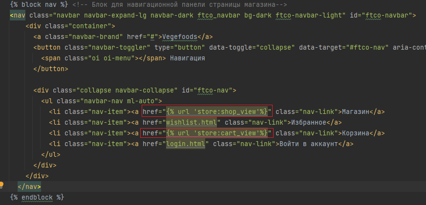

Названия обработчиков возьмём из `urls.py` приложения `store` 

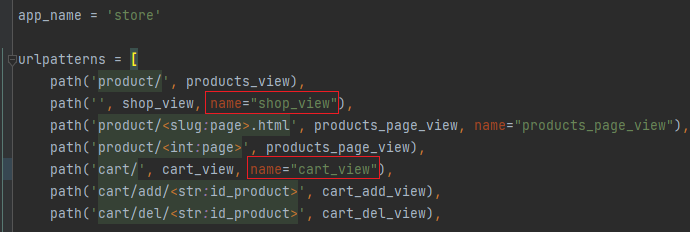

Теперь во всех html файлов, где используется `base.html` появились актуальные ссылки для перехода


### 1. Работа с корзиной

Ранее мы реализовали отображение корзины, теперь реализуем определенный функционал в данной корзине.

#### 1.1 Реализация проверки действия купона

Поступил запрос на разработку функционала проверки купона со стороны сервера для применения его к стоимости заказа.

Необходимо реализовать обработчик, который возвращает JSON с данными действителен ли купон и процент скидки 
со стоимости товара.

*Как всё работает на стороне клиента?*

Работа построена на javascript обработчике со стороны клиента, который отравляет `GET запрос` на адрес `http://127.0.0.1:8000/coupon/check/<name_coupon>` , где
`<name_coupon>` код купона, получаемый из HTML формы. Javascript обработчик получает JSON со стороны сервера и проверяет поля
`"is_valid"` и `"discount"`. 

Если `"is_valid"` равно `True` значит купон действительный и можно посмотреть какой у него размер скидки `"discount"`,
после применения купона произойдет пересчет общей стоимости заказа с учетом скидки и под кнопкой проверить появится надпись `f'Купон действителен! Размер скидки: {discount} %'`.

Если `"is_valid"` равно `False`, то под кнопкой проверить появится надпись `'Купон не действителен!'`

Если в JSON вернётся ошибка, то обработчик воспримет, что данного купона не существует и под кнопкой проверить появится 
надпись `'Произошла ошибка при проверке купона'`

Всё что описано, не нужно реализовывать, это уже есть на стороне клиента.

*Что необходимо сделать нам?*

Нам необходимо написать представление, которое обработает входящий запрос и вернёт JSON с ключами `"is_valid"` и `"discount"`,
если такой купон есть в базе, а если его нет то вернет объект `HttpResponseNotFound("Неверный купон")`.

Заполните представление `coupon_check_view`, и доведите его до рабочего состояния

```python
def coupon_check_view(request, name_coupon):
    # DATA_COUPON - база данных купонов: ключ - код купона (name_coupon); значение - словарь со значением скидки в процентах и
    # значением действителен ли купон или нет
    DATA_COUPON = {
        "coupon": {
            "value": 10,
            "is_valid": True},
        "coupon_old": {
            "value": 20,
            "is_valid": False},
    }
    if request.method == "GET":
        # TODO Проверьте, что купон есть в DATA_COUPON, если он есть, то верните JsonResponse в котором по ключу "discount"
        # получают значение скидки в процентах, а по ключу "is_valid" понимают действителен ли купон или нет (True, False)

        # TODO Если купона нет в базе, то верните HttpResponseNotFound("Неверный купон")
```

Представление должно обрабатываться по маршруту `coupon/check/``<``slug:coupon``>` в `urls.py` приложения `store`

Проверить работу можно по маршруту 

http://127.0.0.1:8000/coupon/check/coupon

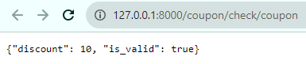

А в корзине покупок при применении промокода появится следующее.


#### 1.2 Реализация расчёта стоимости доставки

Поступил запрос на разработку функционала расчёта стоимости доставки со стороны сервера для применения данной стоимости 
к стоимости заказа.

Здесь всё, как и в прошлый раз работает javascript, а нам необходимо реализовать обработку запросов.

В этот раз на стороне клиента происходит GET запрос c параметрами по адресу `http://127.0.0.1:8000/delivery/estimate?country=<country>&city=<city>&code=<code>`,
`<country>`, `<city>` и `<code>` - страна, город и почтовый код для доставки соответственно.

На стороне клиента ожидается возвращения JSON с ключом `"price"` значение которого будет соответствовать стоимости доставки.

Если по какой-то причине нельзя рассчитать стоимость доставки, то верните `HttpResponseNotFound("Неверные данные")`

Предлагается заполнить представление `delivery_estimate_view` возвращающее JSON

```python
def delivery_estimate_view(request):
    # База данных по стоимости доставки. Ключ - Страна; Значение словарь с городами и ценами; Значение с ключом fix_price
    # применяется если нет города в данной стране
    DATA_PRICE = {
        "Россия": {
            "Москва": {"price": 80},
            "Санкт-Петербург": {"price": 80},
            "fix_price": 100,
        },
    }
    if request.method == "GET":
        data = request.GET
        country = data.get('country')
        city = data.get('city')
        # TODO Реализуйте логику расчёта стоимости доставки, которая выполняет следующее:
        # Если в базе DATA_PRICE есть и страна (country) и существует город(city), то вернуть JsonResponse со словарём, {"price": значение стоимости доставки} 
        # Если в базе DATA_PRICE есть страна, но нет города, то вернуть JsonResponse со словарём, {"price": значение фиксированной стоимости доставки} 
        # Если нет страны, то вернуть HttpResponseNotFound("Неверные данные")
```

Представление должно обрабатываться по маршруту `delivery/estimate` в `urls.py` приложения `store`

Проверить работу можно по маршруту 

http://127.0.0.1:8000/delivery/estimate?country=Россия

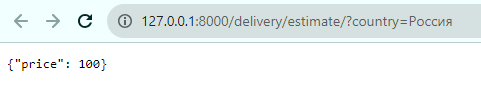

А в корзине покупок при расчёте доставки появится следующее.

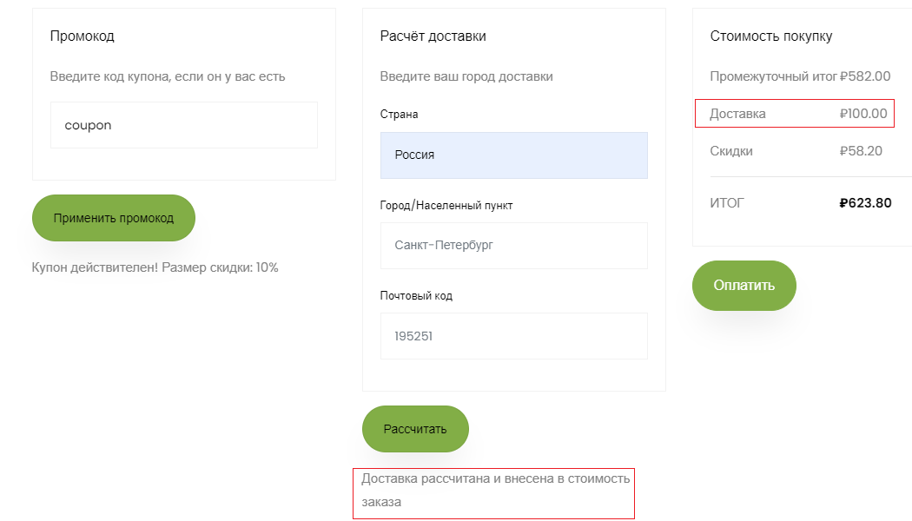

#### 1.3 Добавление продуктов в корзину

##### 1.3.1 Добавление без перехода в корзину

Фронтенд разработчик попросил в наш `shop.html` вставить разработанные им javascript код, для добавления товаров в корзину
по нажатии на иконку


но сказал, чтобы всё корректно работало, то необходимо, чтобы в свойстве `data-product-id` содержался 
id товара, который будет добавляться в корзину.

Поможем ему и добавим этот функционал. Для этого обратимся в `shop.html` и добавим блок 

```html



```

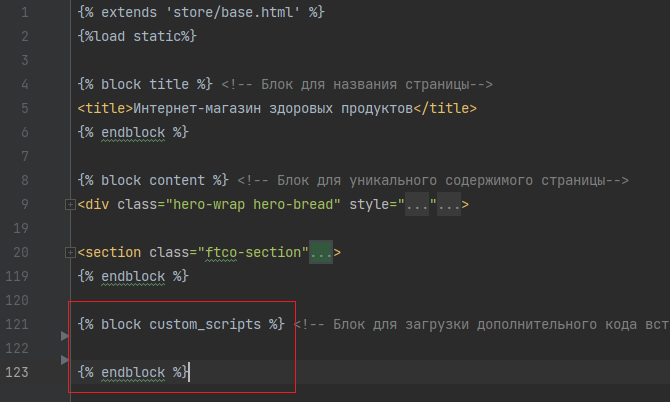

Помним, что создали данный блок в `base.html` специально для добавления javascript кода

А уже в данном блоке пропишем тот код фронтенд разработчика

```html
<script>
	// Функция для показа всплывающего сообщения

	function showPopupMessage(productID, message) {
    let popupMessage = document.querySelector(`.custom-popup-message[data-product-id="${productID}"]`);
    popupMessage.textContent = message;
    popupMessage.style.display = 'block';
    setTimeout(function() {
        popupMessage.style.opacity = 1;
    }, 10);
    setTimeout(function() {
        popupMessage.style.opacity = 0;
        setTimeout(function() {
            popupMessage.style.display = 'none';
        }, 250); // Исчезнет через 0.25 секунды
    }, 750); // Показывается в течение 0.75 секунд
}
</script>

<script>
	// Добавление продукта в корзину
	function addToCart(event) {
		// Получаем значение купона, которое вы хотите проверить
		event.preventDefault();
		let linkCart = event.target; // Получаем элемент ссылки, на которой был клик
		// console.log(linkCart)
    	let productId = linkCart.getAttribute('data-product-id'); // Получаем ID товара
		console.log(productId)
		linkCart.disabled = true;

		// Отправляем асинхронный GET-запрос на сервер для проверки купона
		fetch('/cart/add/' + productId, {
			method: 'GET'
		})
		.then(function(response) {
			// Проверяем статус ответа
			if (!response.ok) {
				throw new Error('Ошибка при добавлении в корзину');
			}

			// Проверяем наличие редиректа
			if (response.redirected) {
				console.log('Произошел редирект на:', response.url);
				window.location.href = response.url; // Пример перенаправления на другую страницу
				return; // Прерываем выполнение функции
			}

			return response.json(); // Продолжаем обработку JSON-данных
		})
		.then(function(data) {
			// Обрабатываем данные, которые пришли с сервера
			if (data.answer === 'Продукт успешно добавлен в корзину') {
				showPopupMessage(productId, 'Продукт успешно добавлен в корзину');
			}
		})
		.catch(function(error) {
			// Обрабатываем ошибку
			console.error(error);
		})
		.finally(function() {
			// Включаем ссылку обратно после получения ответа (успешного или с ошибкой)
			linkCart.disabled = false;
		});
	};
	let addButtons = document.querySelectorAll('.add-to-cart');
	addButtons.forEach(function(button) {
		button.addEventListener('click', addToCart);
	});

</script>
```

Но одного кода мало нам необходимо в свойстве `data-product-id` тегов html передать id продукта, так сделаем это

В `shop.html` найдём блок `<div class="m-auto d-flex">` отвечающий за выпадающее меню товара и произведем изменения

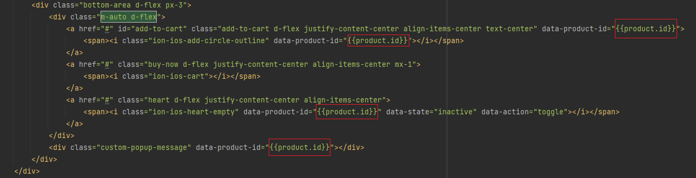

Теперь если всё сделано верно, то при нажатии на добавления товара на главной странице появится всплывающее окно,
а товар будет добавлен в корзину.


##### 1.3.2 Добавление товара с переходом в корзину

Реализуем данную функциональность средствами Django.

Что сделаем:

* Создадим представление для обработки запроса на добавление

Для этого используем метод `redirect`, который перенаправляет наш запрос на другой обработчик.
В нашем случае на обработчик занимающийся показом корзины (маршрут `/cart/`)

Создадим представление `cart_buy_now_view`, но предварительно импортируем метод `redirect`

```python
from django.shortcuts import redirect
```

```python
def cart_buy_now_view(request, id_product):
    if request.method == "GET":
        result = add_to_cart(id_product)
        if result:
            return redirect("store:cart_view")

        return HttpResponseNotFound("Неудачное добавление в корзину")
```
Почему мы возвращаем `redirect` на обработчик корзины? Это сделано для уменьшения дублирования кода,
то есть мы делегируем полномочия на другой обработчик. 

Это означает, что после обработке маршрута, мы добавим в корзину, а далее мы не останемся на данном маршруте,
а просто перейдём по маршруту который отображает корзину, так пользователь 
не будет видеть лишние действия со стороны сервера.

* Зарегистрируем маршрут по пути `cart/buy/<str:id_product>`

```python
path('cart/buy/<str:id_product>', cart_buy_now_view, name="buy_now"),
```

* Пропишите обработчик в `shop.html` 

```html
href=""
```

Место для ссылки находится рядом с той кнопкой добавления

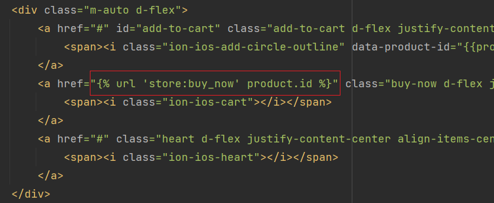

Теперь при нажатии на добавление товара с переходом в корзину, происходит ровно то, что и требовалось

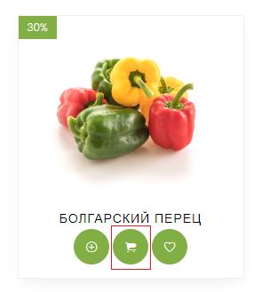

*Дополнительно*

Выше в обработчике `cart_buy_now_view` использовали редирект, но что если передать туда просто вызов другого обработчика,
изменится ли что-то или нет?

Посмотрите разницу между двумя подходами в обработчике `cart_buy_now_view`, когда возвращаем функцию представление,
вместо перенаправления `redirect("store:cart_view")` вернем `cart_view(request)`

```python
def cart_buy_now_view(request, id_product):
    if request.method == "GET":
        result = add_to_cart(id_product)
        if result:
            return cart_view(request)

        return HttpResponseNotFound("Неудачное добавление в корзину")
```

Проанализируйте, что изменилось. 

После анализа верните обратно `redirect("store:cart_view")`, так как данный 
механизм чаще используют.


##### 1.3.3 Удаление продуктов из корзины

С вопросами добавления мы разобрались, но удаление из корзины через адресную строку всё так же неудобно.

Если заглянуть в корзину, то у товаров можно заметить одну особенность, это крестик рядом с картинкой товара.

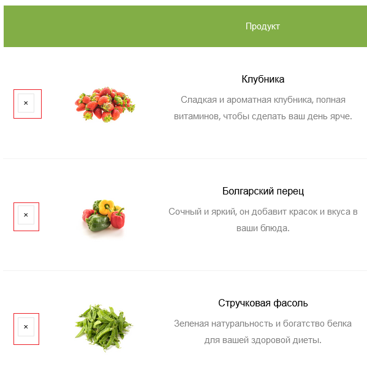

На крестик можно нажать, но ничего не произойдёт. Используем его для вызова обработчика и удаления позиции из корзины.

Реализуйте самостоятельно механизм удаления из корзины, следуя шагам:

* Реализуйте представление `cart_remove_view`, оно очень похоже на `cart_buy_now_view`, только с уклоном на удаление, а не добавление.

Посмотрите при помощи какой функции вы удаляли продукт из корзины в представлении `cart_del_view` когда работали с JSON.
Используйте эти знания для реализации `cart_remove_view`

``````python
def cart_remove_view(request, id_product):
    if request.method == "GET":
        result = ...  # TODO Вызвать функцию удаления из корзины 
        if result:
            return ...  # TODO Вернуть перенаправление на корзину

        return HttpResponseNotFound("Неудачное удаление из корзины")
``````

* Настройте маршрут на путь `cart/remove/<str:id_product>`

```python
path('cart/remove/<str:id_product>', cart_remove_view, name="remove_now"),
```

* Пропишите обработчик в `cart.html` используя тег `` 
(аналогично как для добавления в корзину с переходом)

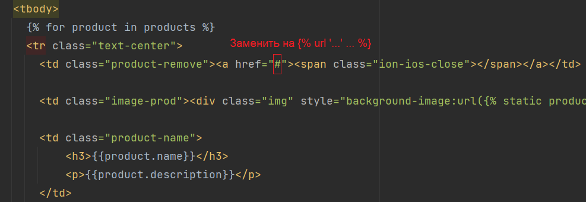

Если всё верно прописано, то при нажатии на крестик, будет вызван переход по нужному маршруту,
затем вызван обработчик `cart_remove_view` который перенаправит на отображение корзины после 
удаления товаров из корзины.

Проверьте работоспособность данной функциональности.


### 2. Работа с авторизацией

Вроде бы уже сделано многое, а как авторизоваться на сайте у нас нет, хотя в навигационной панели есть переход к форме авторизации.

Представлений в нашем приложении store большое количество, уже сложно следить за каждым из них, давайте создадим отдельное приложение для
авторизации и регистрации. 

На практике типовые приложения Django для интернет-магазина продуктов могут включать:

* `Каталог`: для управления продуктами, категориями и тегами.
* `Корзина`: для управления выбранными пользователем продуктами.
* `Заказы`: для управления информацией о заказах и статусах.
* `Платежи`: для обработки платежей и интеграции с платежными шлюзами.
* `Аутентификация и авторизация`: для управления пользователями и входом в систему.
* `Уведомления`: для отправки уведомлений пользователям о статусе заказа и другой информации.

#### 2.1 Настройка приложения для авторизации

Сделаем ряд действий:

1. Создадим новое приложение `app_login` воспользовавшись командой `python manage.py startapp app_login`.

2. Зарегистрируем приложение в `settings.py` в словаре `INSTALLED_APPS`

3. В приложении создадим папки `static` и `templates`, а в них папку `login`(чтобы чуть сократить название,
хотя по обычаю создавали папку с названием приложения)

4. Скопируем данные в `app_login/static/login` из `files/lab5/static`, а в `app_login/templates/login` скопируйте 
файл `login.html` из `files/lab5/`. Также в `app_login` скопируйте с заменой файлы `views.py` и `urls.py` из
`files/lab5/`.

В итоге `app_login` будет выглядеть так

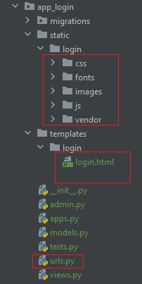

5. В корневом `urls.py` папки `project` пропишем маршрут до приложения `app_login`

```python
path('login/', include('app_login.urls')),
```

6. Для удобства пропишем ссылку в навигационной панели в `base.html` (приложение `store`) на форму авторизации

Самостоятельно пропишите ссылку, посмотрите какой маршрут вызывает отображение авторизационной формы.

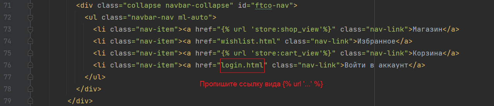


#### 2.2 Регистрация пользователя

Зарегистрируем пользователя. В этот раз не будет пользоваться созданием своей базы пользователя, а оставим это на Django.

В Django есть механизм позволяющий регистрировать администраторов в системе. Администратор, это пользователь 
наделённый максимальными правами в системе, однако, это пользователь, поэтому мы это и используем.

Перед регистрацией воспользуемся командой для формирования всех таблиц во внутренней базе данных Django, это необходимо для последующего
создания пользователя в базе Django.

```python
python manage.py migrate
```
В консоле можно увидеть, что создались определенные системные таблицы для хранения информации.

Для регистрации воспользуемся командой 

```python
python manage.py createsuperuser
```
Далее вам предстоит придумать логин, допустим `admin`. 

Графу `Email address` можно оставить пустой.

Затем нужно придумать пароль, пароль может быть очень простой. Внимание при вводе пароля, пароль не будет отображаться в консоле,
не пугайтесь этого, это один из способов защиты при вводе пароля. Допустим можно в качестве пароля использовать `123`

Затем повторите ваш набранный ранее пароль.

Если пароль будет слабый по защите, то появится вопрос, с уверенностью создания такого слабого пароля. Введите `y`

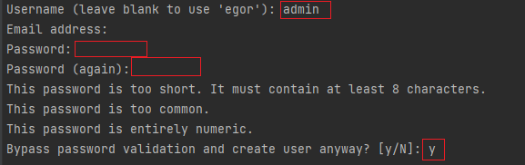

Затем ваш пользователь будет создан. Но не будет авторизован в системе, т.е. сервер не понимает, что именно данный пользователь
сейчас на сайте.

Давайте авторизуемся под этим пользователем.

#### 2.3 Аутентификация и авторизация пользователя

У Django есть специальный механизм по аутентификации (механизм узнавания пользователя) 
и авторизации(механизм определения пользователя в системе).

У нас есть `login.html` который предоставляет форму авторизации по логину и паролю. Используем его для наших нужд. Но сначала
нужно указать форме куда высылать данные из неё. Для этого в шаблоне `login.html` в блоке form пропишите пару свойств 

```html
action="." method="post"
```
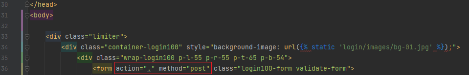

Так как пароль всё же закрытая информация, то передавать всё будем в методе POST, поэтому в форме прописан пост метод.
А `action="."`, что отправляем на свой же адрес, просто тем методом, что объявлен в `method`.

Также необходимо добавить токен ``. Django старается при обработке POST запросов проверить 
защищенность формы от подмены элементов формы, для этого есть механизм CSRF токенов в Django.

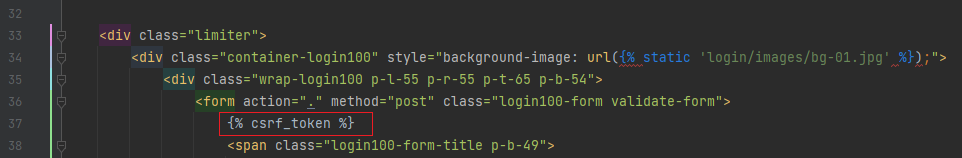

Затем воспользуемся встроенными функциями `authenticate` и `login` из `django.contrib.auth`

```python
from django.contrib.auth import login, authenticate
from django.shortcuts import render, redirect


def login_view(request):
    if request.method == "GET":
        return render(request, "login/login.html")

    if request.method == "POST":
        data = request.POST
        user = authenticate(username=data["username"], password=data["password"])
        if user:
            login(request, user)
            return redirect("/")
        return render(request, "login/login.html", context={"error": "Неверные данные"})
```

Логика тут следующая:
* Из запроса мы получаем информацию(`request.POST`), ту что передали в форму


* Затем мы проводим проверку, что данный пользователь существует при помощи `authenticate`, если пользователь есть в базе Django,
то он вернется, если нет, то вернется `None`


* Если пользователь существует, то при помощи функции `login` мы авторизуем пользователя в системе и перенаправляем на главную страницу.


* Если пользователя не существует или были введены ошибочные данные, то отправляем на страницу авторизации с текстом "Неверные данные".
В `login.html` уже прописан параметр `{{error}}` для возможности отображения ошибок в форме при рендринге. 

Теперь пользователь явно авторизуется.

#### 2.4 Отображение авторизированного пользователя в шапке 

Пользователь авторизирован, но не понятно какой именно пользователь авторизирован.

Для этого в навигационную панель шаблона `base.html` добавим пару строк

Вместо 
```html
<li class="nav-item"><a href="" class="nav-link">Войти в аккаунт</a>
```

Поставим 

```html

<li class="nav-item"><a href="" class="nav-link">Выйти из аккаунта</a>
<li class="nav-item"><a class="nav-link">Привет {{user.username}}!</a>

<li class="nav-item"><a href="" class="nav-link">Войти в аккаунт</a>

```

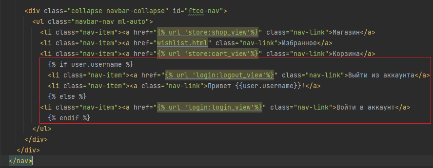

Мы видим, что добавлена строка "Выйти из аккаунта" и тег `` который будет требовать обработчика. 

Вам необходимо самостоятельно написать функцию представление в `views.py` приложения `app_login` и прописать маршрут 
зайдя на который можно будет разлогиниться.

Используйте шаблон ниже для функции представления

```python
from django.contrib.auth import logout

def logout_view(request):
    if request.method == "GET":
        logout(request)  # Функция разлогинивает пользователя
        return ... # TODO Верните редирект на главную страницу
```

Зарегистрируйте маршрут исходя из требований тега ``

Теперь если зайти на главную страницу будет показываться имя пользователя, 
пропадет кнопка авторизации, так как пользователь авторизирован, а появится кнопка выхода из аккаунта (если правильно прописали маршрут и представление)

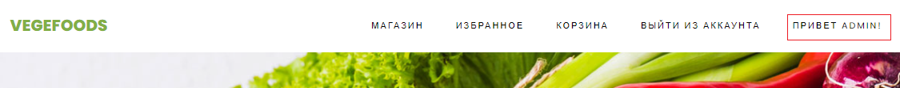

Зарегистрируйте новый аккаунт через `python manage.py createsuperuser`

Разлогиньтесь и авторизируйтесь под другим аккаунтом. 

#### 2.5 Связь пользователя и корзины

Теперь нужно подправить корзину, так как при переходе в корзину пользователь 
не связан с корзиной. У нас была описана абстрактная корзина, без привязки пользователя.

Первое, что необходимо сделать, поправить функции `view_in_cart`, `add_to_cart`, 
`remove_from_cart` в `services.py`, чтобы как-то связать пользователя. Главное, что нам необходимо добавить
это определение текущего пользователя в системе.

Для этого воспользуемся функцией `get_user`
```python
from django.contrib.auth import get_user
```
Но для работы `get_user` необходимо на вход подать `request`, поэтому в `view_in_cart`, `add_to_cart`, 
`remove_from_cart` на входе также подадим `request`, так как в функциях необходимо будет знать какой пользователь сейчас в магазине.

Во `view_in_cart` замените прошлую пустую корзину на `{user: {'products': {}}}`

```python
cart = {'products': {}}  # было

# from django.contrib.auth import get_user
user = get_user(request).username  # Получаем авторизированного пользователя
cart = {user: {'products': {}}}  # стало
```

Также на вход `view_in_cart` передадим `request`

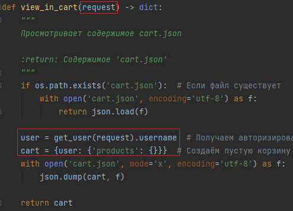


В `add_to_cart` произведем замену, чтобы получить корзину авторизированного пользователя.
А записываем мы общую базу, так как частично json изменить нельзя.

```python
cart = view_in_cart()  # было

cart_users = view_in_cart(request)
cart = cart_users[get_user(request).username]  # стало


json.dump(cart, f)  # было
json.dump(cart_users, f)  # стало
```
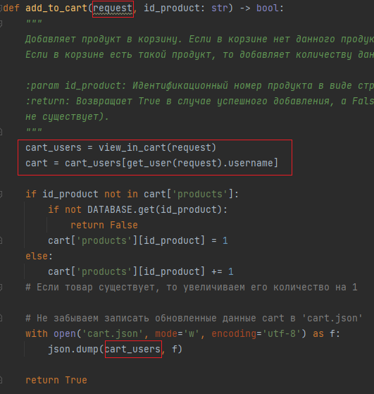

При обработке `remove_from_cart` необходимо сделать аналогичное действие, 
получить корзину авторизированного пользователя. А записываем мы общую базу, так как частично json изменить нельзя.

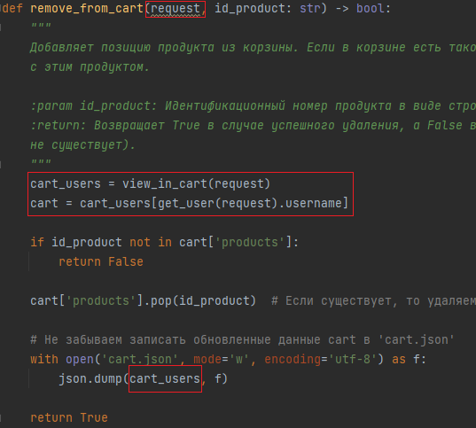

Но остаётся ещё один момент который нужно учесть, считается, что для работы `view_in_cart`, `add_to_cart`, 
`remove_from_cart` пользователь уже есть в базе корзины, но сам же он туда не попадёт, поэтому создадим новую функцию, которая добавляет пользователя в корзину.

В `services.py` создайте `add_user_to_cart`.

```python
def add_user_to_cart(request, username: str) -> None:
    """
    Добавляет пользователя в базу данных корзины, если его там не было.

    :param username: Имя пользователя
    :return: None
    """
    cart_users = view_in_cart(request)  # Чтение всей базы корзин

    cart = cart_users.get(username)  # Получение корзины конкретного пользователя

    if not cart:  # Если пользователя до настоящего момента не было в корзине, то создаём его и записываем в базу
        with open('cart.json', mode='w', encoding='utf-8') as f:
            cart_users[username] = {'products': {}}
            json.dump(cart_users, f)
```

Теперь осталось установить, в какой момент будет добавляться пользователь в базу данных корзин. Вообще при процедуре регистрации или авторизации Django это не предусматривает,
он работает только с пользователем. В зависимости от поставленных задач корзина может создасться как при регистрации, так и при авторизации пользователя.
В нашем случае выберем вариант создания корзины при авторизации пользователя. 

В приложении `app_login` во `views.py` в отображении `login_view` вызовем `add_user_to_cart` после авторизации пользователя


Логику мы настроили. Теперь осталось во `views.py` поменять приложения `store` поправить представление `cart_view`

Ранее у нас было написано `data = view_in_cart()`, но теперь `view_in_cart` возвращает не корзину пользователя, 
а всю базу корзин. По имени пользователя получим корзину.

```python
current_user = get_user(request).username
data = view_in_cart(request)[current_user]
```

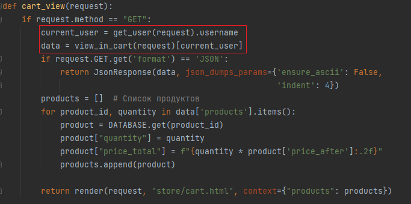

Также необходимо поправить все вызовы функций `add_to_cart`, `remove_from_cart` во `views.py` приложения `store`, так как
теперь они требуют `request` на вход. 

```python
add_to_cart(request, id_product)
remove_from_cart(request, id_product)
```

Поправьте `add_to_cart` и `remove_from_cart` в соответствующих `cart_buy_now_view`, `cart_remove_view`, 
`cart_add_view`, `cart_del_view`.

Во избежание некорректной совместимости прочитанных данных из `cart.json`, то удалите его. Он сам создастся при первой авторизации

Теперь у нас появилась возможность просматривать корзину авторизированного пользователя. Проверьте, что функциональность
нашего магазина не изменилась. Авторизируйтесь по разными пользователями, добавьте разные продукты, разными способами. Проверьте, что
у разных пользователей сохраняются их корзины.

Если выйти из аккаунта пользователя, то при добавлении в корзину или при просмотре корзины, мы получаем ошибку, что в базе нет неизвестного пользователя,
для этого база и существует, чтобы его там не было иначе каждый неавторизированный пользователь 
мог бы изменять корзину любого неавторизированного пользователя в системе.

Поэтому реализуем механизм ограничения доступа к определенным действиям на сайте для неавторизированного пользователя.

#### 2.6 Ограничение доступа к определенным частям сайта неавторизированным пользователям

Механизм ограничения доступа будем реализовывать при помощи декоратора `login_required` из `django.contrib.auth.decorators`

```python
from django.contrib.auth.decorators import login_required
```

Применим декоратор на функцию `cart_view`.

```python
@login_required(login_url='login:login_view')
```

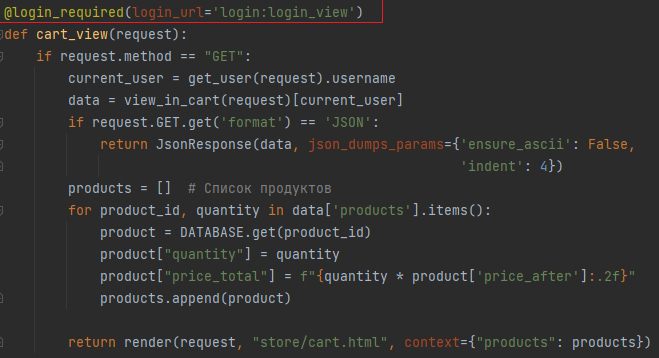

Теперь если пользователь не авторизирован, то при переходе на корзину - пользователя перенаправят на форму авторизации. 
Т.е. при любом вызове обработчика, показывающий корзину, теперь будет требоваться авторизация.

Однако, проверьте, работает ли теперь обыкновенное добавление в корзину с и без перехода, для неавторизированного пользователя?
Видим, что ничего не происходит, а должно отправлять в форму регистрации. 

Добавим декораторы на соответствующие обработчики.

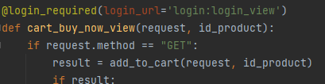

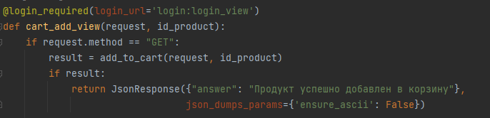

Теперь всё должно работать корректно. Проверьте функционал, что товар добавляется в корзину только авторизированным пользователем. 
При этом просмотр товаров можно осуществлять неавторизированным пользователям.

### Практика окончена

Зафиксируем изменения сделав коммит и отправим эти коммиты на github