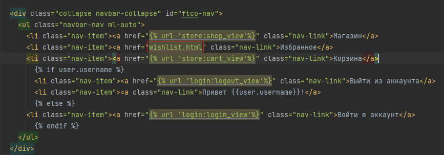
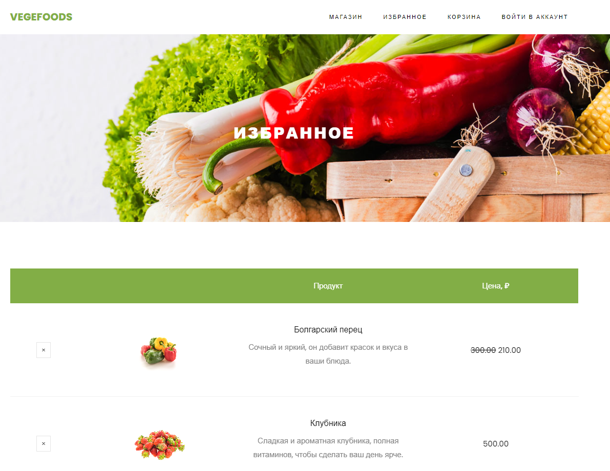
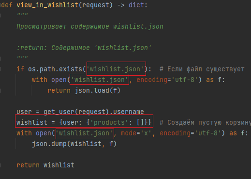
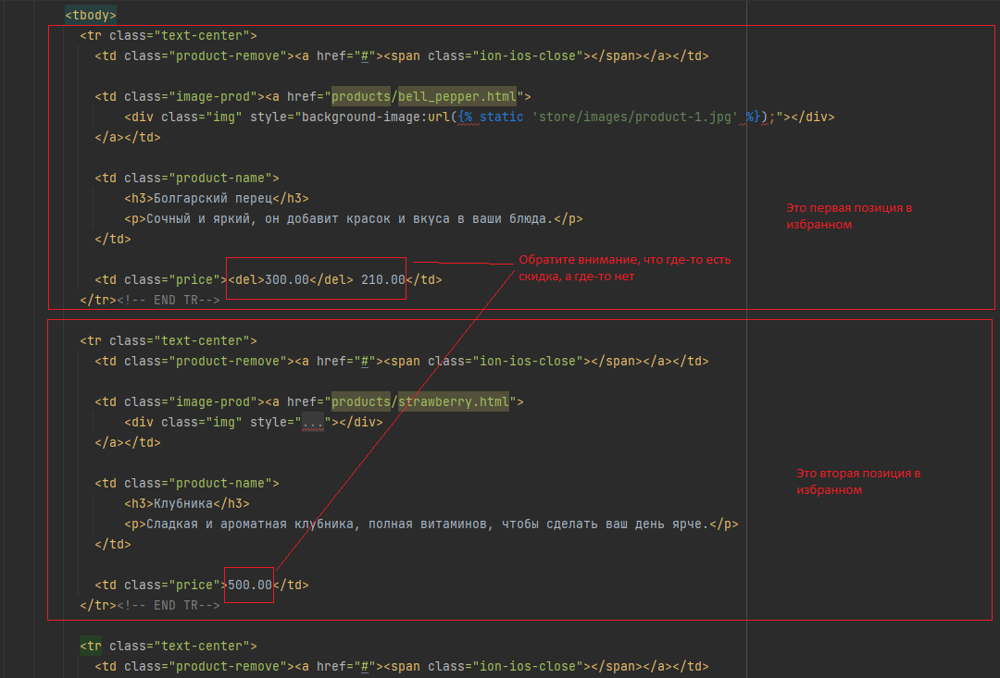
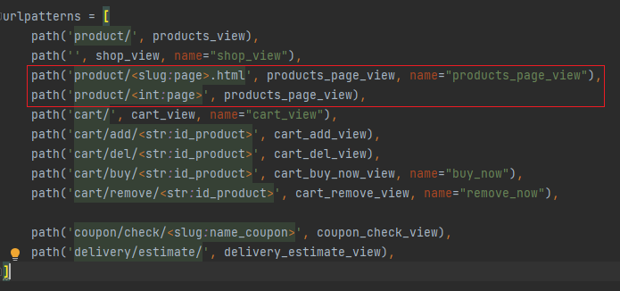
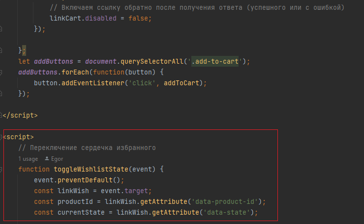
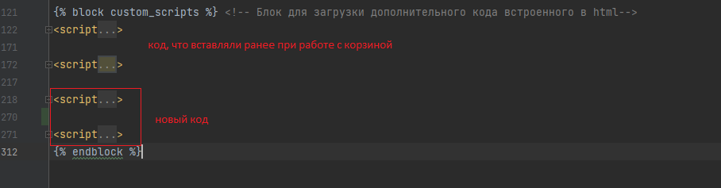
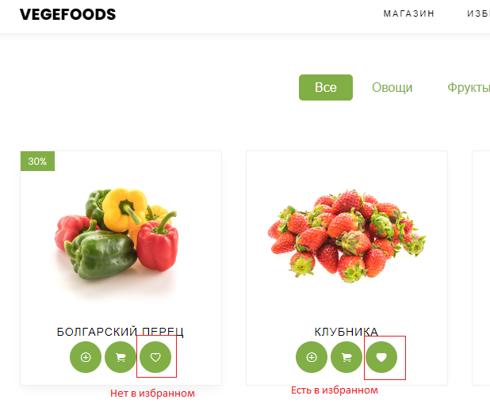
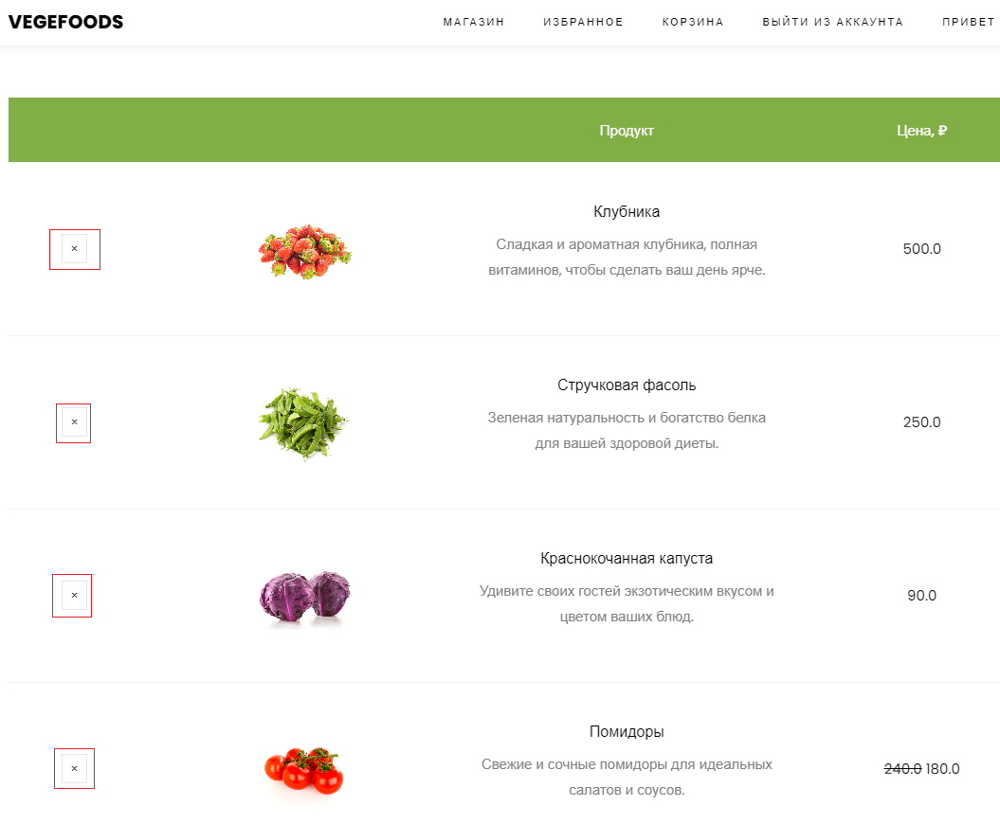

### Зачётное задание

В зачётном задании будет необходимо реализовать функционал избранного по приведенному шаблону.

Шаблон `wishlist.html` приведён в `files/lab6_exam`

На базе того, что мы сделали теперь самостоятельно предстоит разработать функционал избранного. 

Чтобы не разбежались глаза от объёма работы, то будут приведены шаблоны, которые необходимо заполнить. 
Также будет приведен порядок действий.


#### Этап1. Создайте новое приложение wishlist

Помните, что приложение необходимо будет зарегистрировать в словаре `INSTALLED_APPS` файла `settings.py`.

Создайте в папке приложения папку `templates`, а уже в ней папку `wishlist` как делали обычно ранее.

Создайте файл `urls.py` в папке приложения.

#### Этап2. Подключите шаблон wishlist.html

Перенесите шаблон `wishlist.html` из `files/lab6_exam` в `wishlist/templates/wishlist`.

Во `views.py` приложения `wishlist` пропишите представление отображающее избранное

```python
def wishlist_view(request):
    if request.method == "GET":
        ...  # TODO прописать отображение избранного. Путь до HTML - wishlist/wishlist.html
```

Затем в `urls.py` заполните

```python
from django.urls import path
#  TODO Импортируйте ваше представление

app_name = 'wishlist'

urlpatterns = [
    path(..., ..., name=...),  # TODO Зарегистрируйте обработчик
]
```

В корневом `urls.py` папки `projects` зарегистрируйте маршрут приложения

```python
urlpatterns = [
    ...,
    path(..., include(...)),  # TODO Зарегистрируйте маршруты приложения так чтобы обработчик избранного обрабатывался по пути /wishlist/
    ...,
]
```

Проверьте работоспособность маршрута http://127.0.0.1:8000/wishlist/

В `base.html` приложения `store` в навигационной панели пропишите ссылку, для перехода в избранное по ссылке.



#### Этап3. Настройте шаблон wishlist.html

Мы видим, что у `wishlist.html` аналогичная структура, что и у `cart.html`, `shop.html`, поэтому приведите к блоковым элементам как `shop.html` и `cart.html`

```html
 <!-- Расширение не меняем, оно нормально подтянется-->


 <!-- Блок для названия страницы-->
<title>Избранное</title>


 
    <!-- Оформите здесь код уникального содержимого из wishlist.html как делали в cart.html или shop.html-->

```

Затем, где это требуется, запишите тег `static` у статических объектов шаблона `wishlist.html`

Оформление тега `static` ничем не отличается от подходов в `cart.html`, `shop.html`. Так как что там, что там вы прописывали, что
поиск статических файлов будет в приложении `store`, а там они и находятся.

Затем после того, как ваше избранное стало нормально отображаться, настало поработать с базой для хранения товаров в избранном.



База будет храниться в `wishlist.json` аналогично, как и в `cart.json` поэтому можете смело продублировать обработчики 
`view_in_cart`, `add_to_cart`, `remove_from_cart`, `add_user_to_cart` из `logic/services.py`. Данные обработчики переименуйте, чтобы было понятно,
что происходит работа с избранным и внутреннее содержание поменяйте, чтобы понятно, что это не для корзины, а для избранного.

Единственное различие будет в том, что ранее для корзины мы данные хранили так `cart = {user: {'products': {}}}` у нас 
у ключа `products` был свой словарь, а теперь там будет список, так как нам не нужно хранить количество товара, нам нужен
просто идентификатор товара.

Вот для примера `view_in_wishlist` созданный на базе `view_in_cart` в `services.py`



Также при создании `add_to_wishlist` учтите, что добавлять продукт в избранное стоит если до добавления его там не было.

Для удаления продукта из избранного в `remove_from_wishlist`, учите, что метод `pop`, что использовался для обработчиков cart - 
теперь не подойдет, будет лучше использовать метод списка `remove` удаляющий объект по значению, а не индексу как в `pop`.

После создания `view_in_wishlist`, `add_to_wishlist`, `remove_from_wishlist`, `add_user_to_wishlist` в `logic/services.py` допишите представление `wishlist_view`
во `views.py` приложения `wishlist`. 

Необходимо, чтобы в шаблон `wishlist.html` передавались продукты, что находятся в избранном.
Получить эти продукты вы можете из написанной вами функции `view_in_wishlist` из `logic/services.py`.

```python
def wishlist_view(request):
    if request.method == "GET":
        current_user = get_user(request).username
        data = ... # TODO получить продукты из избранного для пользователя
        
        products = []
        # TODO сформировать список словарей продуктов с их характеристиками

        return render(request, 'wishlist/wishlist.html', context={"products": products})
```

По аналогии с корзиной добавьте пользователя в базу избранное при авторизации в представлении `login_view` приложения 
`app_login`.

```python
def login_view(request):
    if request.method == "GET":
        return render(request, "login/login.html")

    if request.method == "POST":
        data = request.POST
        user = authenticate(username=data["username"], password=data["password"])
        if user:
            login(request, user)
            add_user_to_cart(request, user.username)
            ...  # TODO добавить пользователя в базу избранное
            return redirect("/")
        return render(request, "login/login.html", context={"error": "Неверные данные"})
```

#### Этап4. Отобразите продукты в избранном

С использованием языка шаблонов (``, ``, ``) отобразите информацию в избранном. Посмотрите на HTML файл wishlist и разберитесь
какие данные там требуются. 



Все поля которые характеризуют товар вы можете посмотреть в словаре `DATABASE` файла `models.py` приложения `store`.

При нажатии на картинку происходит переход на товар, так что не забудьте это реализовать при помощи ``.
Обработчик уже был написан ранее в `urls.py` приложения `store`. 



На данном этапе будет пустая корзина избранного, так как ничего пока не добавляли в избранное.

#### Этап5. Настройте добавление и удаление продукта в избранное

С добавлением продуктом нам немного помогли. Фронтенд разработчик предложил код для добавления избранного со стороны клиента,
но необходимо реализовать обработчики связывающие избранное.

Добавьте данные код в `shop.html` после дополнительного кода, что когда-то вставляли ранее при работе с корзиной.



В общем виде будет выглядеть так



Код для добавления
```html
<script>
	// Переключение сердечка избранного
	function toggleWishlistState(event) {
		event.preventDefault();
		let linkWish = event.target;

		if (linkWish.getAttribute('data-action') !== 'toggle') {
			linkWish = linkWish.querySelector('i');
		}

		const productId = linkWish.getAttribute('data-product-id');
		const currentState = linkWish.getAttribute('data-state');

		linkWish.disabled = true;

		if (currentState === 'inactive') {
			// Отправить запрос на добавление в избранное
			fetch('/wishlist/api/add/' + productId, { method: 'GET' })
				.then(function (response) {
					if (response.ok) {
						showPopupMessage(productId, 'Продукт успешно добавлен в избранное');
						linkWish.classList.remove('ion-ios-heart-empty');
						linkWish.classList.add('ion-ios-heart');
						linkWish.setAttribute('data-state', 'active');
					} else {
                    // Если произошла ошибка, перенаправьте пользователя на страницу авторизации
                    window.location.href = '/login';
                	}
				})
				.catch(function (error) {
					console.error(error);
				})
				.finally(function () {
					linkWish.disabled = false;
				});
		} else {
			// Отправить запрос на удаление из избранного
			fetch('/wishlist/api/del/' + productId, { method: 'GET' })
				.then(function (response) {
					if (response.ok) {
						showPopupMessage(productId, 'Продукт успешно удалён из избранного');
						linkWish.classList.remove('ion-ios-heart');
						linkWish.classList.add('ion-ios-heart-empty');
						linkWish.setAttribute('data-state', 'inactive');
					} else {
                    // Если произошла ошибка, перенаправьте пользователя на страницу авторизации
                    window.location.href = '/login';
                	}
				})
				.catch(function (error) {
					console.error(error);
				})
				.finally(function () {
					linkWish.disabled = false;
				});
		}
	}

	const addButtonsHeart = document.querySelectorAll('.heart');
	addButtonsHeart.forEach(function (button) {
		button.addEventListener('click', toggleWishlistState);
	});
</script>

<script>
	function showHearts(favoriteProducts) {
		// Проходим по всем ссылкам с классом "heart" и изменяем классы:
		let addButtonsHeart1 = document.querySelectorAll('.heart');
		addButtonsHeart1.forEach(function(button) {
			let productId = button.querySelector('i').getAttribute('data-product-id');

			// Если data-product-id товара есть в списке избранных, меняем классы
			if (favoriteProducts.includes(productId)) {
				let icon = button.querySelector('.ion-ios-heart-empty');
				if (icon) {
					icon.classList.remove('ion-ios-heart-empty');
					icon.classList.add('ion-ios-heart');
					icon.setAttribute('data-state', 'active');
				}
			}

		});
	}
	// Отправляем запрос на получение всех товаров в избранном
	fetch('/wishlist/api/', {
			method: 'GET'
		})
		.then(function(response) {
			// Проверяем статус ответа
			if (!response.ok) {
				throw new Error('Ошибка');
			}
			return response.json();
		})
		.then(function(data) {
			// Обрабатываем данные, которые пришли с сервера
			let favoriteProducts = data.products
			showHearts(favoriteProducts);
		})
		.catch(function(error) {
			// Обрабатываем ошибку
			console.error(error);
		});

</script>
```

Теперь необходимо реализовать несколько обработчиков, которые помогут JS(JavaScript) коду заработать так как нужно.

Необходимо реализовать несколько обработчиков в `views.py` приложения `wishlist` для примера посмотрите как были реализованы
обработчики `cart_add_view`, `cart_del_view` из `views.py` приложения `store` они очень похожие(не забудьте использовать 
`json_dumps_params={'ensure_ascii': False}` в `JsonResponse` для отображения кириллических символов):

```python
def wishlist_add_json(request, id_product: str):
    """
    Добавление продукта в избранное и возвращение информации об успехе или неудаче в JSON
    """
    if request.method == "GET":
        result = ...  # TODO вызовите обработчик из services.py добавляющий продукт в избранное
        if result:
            return ...  # TODO верните JsonResponse с ключом "answer" и значением "Продукт успешно добавлен в избранное"

        return ...  # TODO верните JsonResponse с ключом "answer" и значением "Неудачное добавление в избранное" и параметром status=404


def wishlist_del_json(request, id_product: str):
    """
    Удаление продукта из избранного и возвращение информации об успехе или неудаче в JSON
    """
    if request.method == "GET":
        result = ...  # TODO вызовите обработчик из services.py удаляющий продукт из избранного
        if result:
            return ...  # TODO верните JsonResponse с ключом "answer" и значением "Продукт успешно удалён из избранного"

        return ...  # TODO верните JsonResponse с ключом "answer" и значением "Неудачное удаление из избранного" и параметром status=404


def wishlist_json(request):
    """
    Просмотр всех продуктов в избранном для пользователя и возвращение этого в JSON
    """
    if request.method == "GET":
        current_user = get_user(request).username  # from django.contrib.auth import get_user
        data = ...  # TODO получите данные о списке товаров в избранном у пользователя
        if data:
            return ... # TODO верните JsonResponse c data
        
        return ... # TODO верните JsonResponse с ключом "answer" и значением "Пользователь не авторизирован" и параметром status=404
```

Затем разработчик попросил, чтобы эти обработчики обрабатывались по следующим маршрутам:

| Пример маршрута                          | Действие                                                       | Обработчик          |
|------------------------------------------|----------------------------------------------------------------|---------------------|
| http://127.0.0.1:8000/wishlist/api/add/1 | Добавляет продукт в избранное с id_product = 1                 | `wishlist_add_json` |
| http://127.0.0.1:8000/wishlist/api/del/1 | Удаляет продукт из избранного с id_product = 1                 | `wishlist_del_json` |
| http://127.0.0.1:8000/wishlist/api/      | Предоставляет список всех продуктов в избранном у пользователя | `wishlist_json`     |

Соответственно в `urls.py` приложения `wishlist` пропишите маршруты для заданных обработчиков

Проверьте корректность получаемой информации от этих обработчиков при переходе по ссылкам.

Проверьте, что в избранном действительно добавились или удалились продукты.

Если всё корректно работает, то на главной странице теперь для авторизированного пользователя можно интерактивно добавлять и
удалять продукты из избранного, при помощи нажатия на значёк сердечка. Также при перезагрузке главной страницы останется информация
о товарах в избранном в виде закрашенного сердечка.



Если перейти в избранное, то рядом с товарами будет крестик, который необходим для удаления товара из избранного.

Реализуйте механизм удаления товара, аналогично как реализовывали удаления по крестику из корзины.



#### Этап6. Разграничение доступа пользователя

Сделайте так, чтобы зайти в избранное можно было только авторизированному пользователя. 
Посмотрите как была сделана аналогичная задача с корзиной при помощи декоратора `login_required`.

Со стороны пользователя javascript сам перенаправит на страницу авторизации, если неавторизированный пользователь нажмет
на сердечко.

#### Этап7. Проверьте результат работы вашего нового функционала

1. Создайте нового пользователя под именем `test` с паролем `test`.

2. Разлогиньтесь из пользователя текущего пользователя. Перейдите в избранное, проверьте, что переносит на страницу авторизации.

3. Авторизируйтесть под пользователем `test`. Добавьте пару товаров в избранное. Перезагрузите страницу, проверьте что данные товары
отображаются в избранном (закрашенные сердечки). 

4. Перейдите в избранное, проверьте, что отображаются те товары, что и были добавлены в избранное. 

5. Удалите пару товаров при помощи крестика. Перейдите на главную страницу, проверьте, что теперь закрашенные сердечки остались 
только у тех товаров, что есть в избранном.

6. Разлогиньтесь из пользователя `test`. Проверьте, что при нажатии на сердечко переносит на страницу авторизации.

#### Этап8. Сделайте все необходимые коммиты, отправьте их на github и отправьте ссылку на ваш проект своему преподавателю по практике.